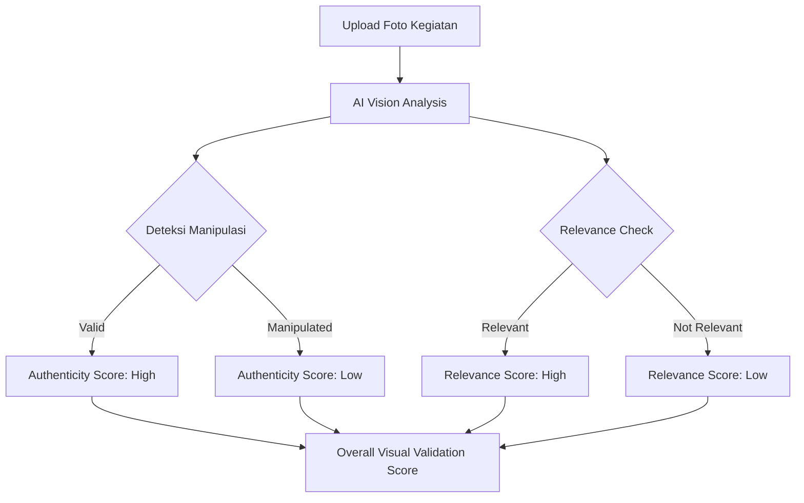
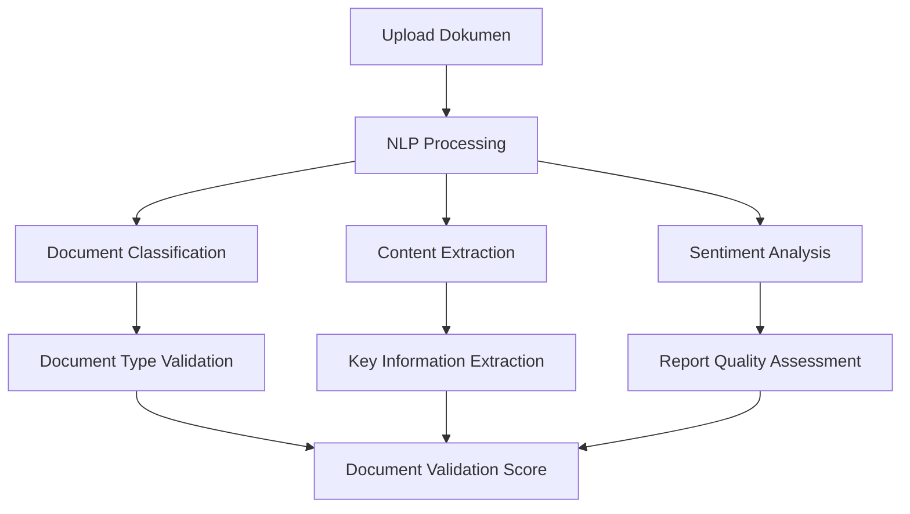
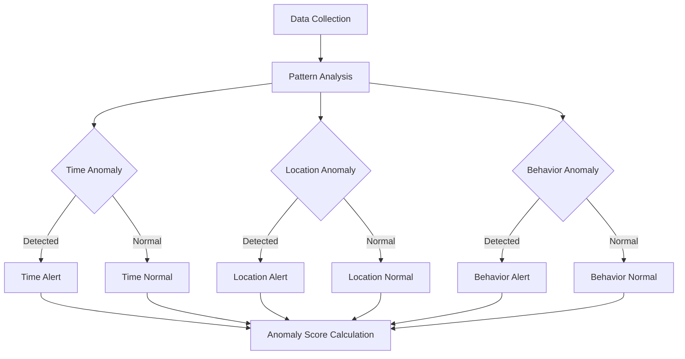
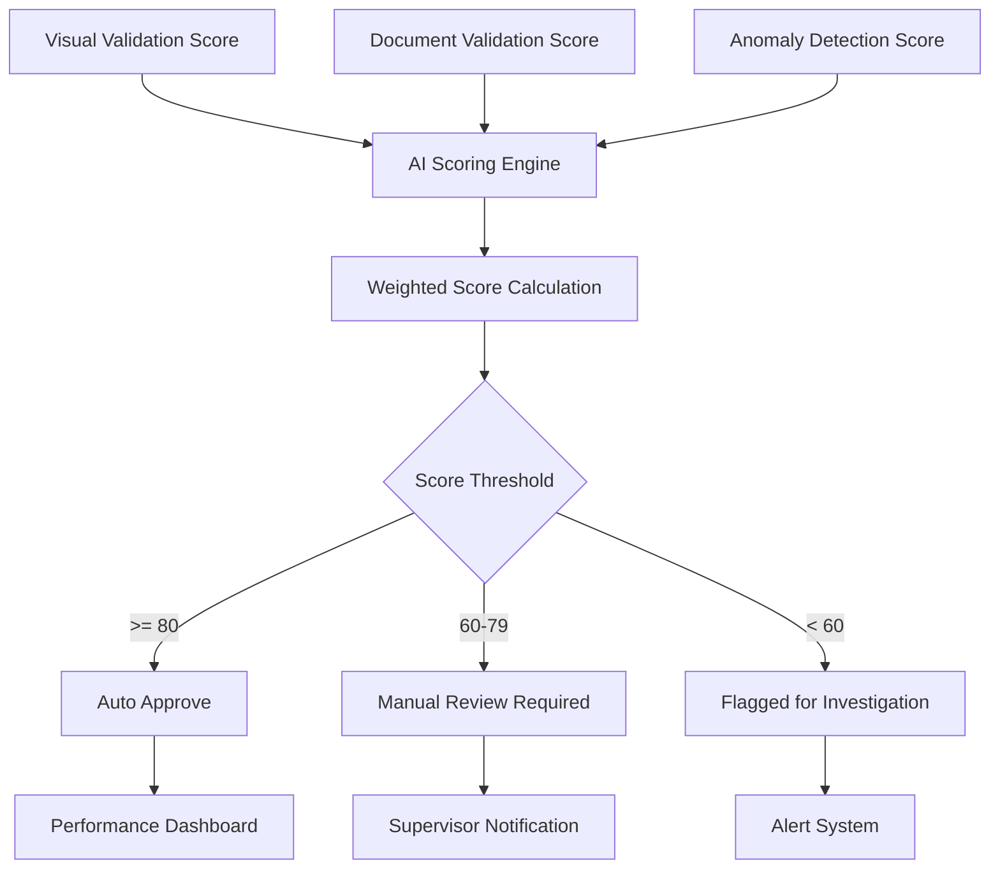
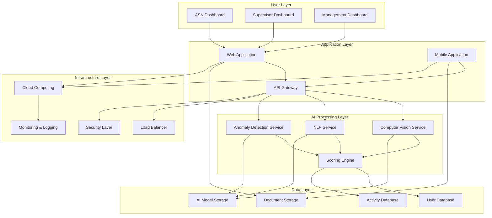

# BAB I - PENDAHULUAN

## 1.1 Latar Belakang

Aparatur Sipil Negara (ASN) merupakan tulang punggung pelayanan publik yang berperan vital dalam menjalankan fungsi pemerintahan. Dalam era digital dan tuntutan good governance yang semakin tinggi, akuntabilitas dan transparansi kinerja ASN menjadi fokus utama reformasi birokrasi. Penilaian kinerja ASN yang objektif, terukur, dan dapat dipertanggungjawabkan merupakan kunci untuk meningkatkan kualitas pelayanan publik.

Perkembangan teknologi Artificial Intelligence (AI) dan machine learning telah membuka peluang besar untuk transformasi digital dalam berbagai sektor, termasuk manajemen SDM pemerintahan. Teknologi AI dapat dimanfaatkan untuk mengotomatisasi proses validasi kegiatan, mendeteksi anomali, dan memberikan penilaian yang objektif berdasarkan data dan bukti yang tersedia.

Sistem tradisional penilaian kinerja ASN yang masih mengandalkan pelaporan manual dan validasi konvensional seringkali menghadapi berbagai tantangan seperti subjektivitas penilaian, keterbatasan sumber daya untuk monitoring, dan potensi manipulasi data. Oleh karena itu, dibutuhkan sebuah sistem inovatif yang dapat mengintegrasikan teknologi AI untuk meningkatkan efektivitas, efisiensi, dan akuntabilitas dalam penilaian kinerja ASN.

Sistem Validasi Kegiatan ASN berbasis AI hadir sebagai solusi komprehensif yang menggabungkan berbagai teknologi canggih seperti Computer Vision, Natural Language Processing (NLP), dan Anomaly Detection untuk memberikan validasi otomatis terhadap laporan kegiatan ASN. Sistem ini tidak hanya meningkatkan akurasi penilaian tetapi juga mendorong transparansi dan kultur kerja yang lebih profesional di lingkungan birokrasi.

## 1.2 Permasalahan

### 1.2.1 Penggelapan Dana dan Manipulasi Keuangan

Salah satu permasalahan serius dalam pelaksanaan kegiatan ASN adalah potensi penggelapan dana operasional dan manipulasi laporan keuangan. Beberapa indikasi permasalahan ini meliputi:

- **Manipulasi kwitansi dan bukti pengeluaran** yang tidak sesuai dengan kegiatan sebenarnya
- **Double claiming** atau pengajuan klaim ganda untuk kegiatan yang sama
- **Mark-up biaya operasional** yang tidak proporsional dengan output kegiatan
- **Penggunaan dana untuk kegiatan pribadi** yang disamarkan sebagai kegiatan dinas
- **Kesulitan tracking penggunaan dana** secara real-time dan transparan

### 1.2.2 Manipulasi Pekerjaan dan Laporan Kegiatan

Sistem pelaporan manual yang ada saat ini rentan terhadap berbagai bentuk manipulasi, antara lain:

- **Pemalsuan dokumentasi kegiatan** seperti foto-foto yang tidak autentik atau diambil dari sumber lain
- **Laporan kegiatan fiktif** yang tidak pernah dilaksanakan secara nyata
- **Manipulasi lokasi dan waktu pelaksanaan** kegiatan untuk menutupi ketidakhadiran
- **Copy-paste laporan** dari kegiatan sebelumnya atau dari ASN lain
- **Exaggeration output kegiatan** yang tidak sesuai dengan realitas di lapangan

### 1.2.3 Kurang Optimalnya Jam Kerja

Permasalahan efektivitas jam kerja ASN mencakup beberapa aspek:

- **Absensi tidak akurat** yang tidak mencerminkan produktivitas sebenarnya
- **Kegiatan non-produktif** selama jam kerja yang sulit dideteksi
- **Ketidaksesuaian antara jam kerja dan output** yang dihasilkan
- **Fleksibilitas jam kerja** yang disalahgunakan untuk kepentingan pribadi
- **Lack of real-time monitoring** terhadap aktivitas ASN di lapangan

### 1.2.4 Ketidakseimbangan Beban Pekerjaan

Distribusi beban kerja yang tidak merata menimbulkan berbagai permasalahan:

- **Overload pada ASN tertentu** sementara yang lain underutilized
- **Kesulitan mengukur kompleksitas** dan tingkat kesulitan setiap jenis kegiatan
- **Ketidakadilan dalam penugasan** berdasarkan kompetensi dan kapasitas
- **Burnout dan penurunan kualitas kerja** akibat beban berlebih
- **Demotivasi ASN** yang merasa tidak dihargai kontribusinya

## 1.3 Harapan, Dampak, dan Solusi

### 1.3.1 Harapan dari Sistem Validasi Kegiatan ASN berbasis AI

**Harapan Jangka Pendek:**

- Transparansi penuh dalam pelaporan kegiatan ASN
- Deteksi otomatis terhadap laporan yang mencurigakan atau tidak valid
- Efisiensi proses validasi dan penilaian kinerja
- Standardisasi format dan kualitas laporan kegiatan

**Harapan Jangka Menengah:**

- Peningkatan akuntabilitas dan integritas ASN
- Optimalisasi alokasi sumber daya dan beban kerja
- Kultur kerja berbasis data dan evidences
- Peningkatan kualitas pelayanan publik

**Harapan Jangka Panjang:**

- Transformasi digital menyeluruh dalam manajemen ASN
- Benchmark system untuk lembaga pemerintah lainnya
- Kontribusi signifikan terhadap reformasi birokrasi
- Model governance yang dapat diadopsi secara nasional

### 1.3.2 Dampak Positif yang Diharapkan

**Dampak bagi ASN:**

- Penilaian kinerja yang objektif dan adil
- Feedback konstruktif untuk pengembangan karier
- Motivasi untuk meningkatkan kualitas kerja
- Perlindungan terhadap tuduhan tidak berdasar

**Dampak bagi Atasan/Supervisor:**

- Tools monitoring yang powerful dan real-time
- Dasar pengambilan keputusan yang akurat
- Efisiensi waktu dalam proses evaluasi
- Identifikasi early warning untuk permasalahan potensial

**Dampak bagi Lembaga:**

- Peningkatan kredibilitas dan trust publik
- Optimalisasi budget dan resource allocation
- Compliance terhadap regulasi dan audit
- Benchmark kinerja yang terukur dan comparable

**Dampak bagi Masyarakat:**

- Pelayanan publik yang lebih berkualitas
- Transparansi penggunaan anggaran negara
- Kepercayaan terhadap institusi pemerintah
- Partisipasi aktif dalam pengawasan publik

### 1.3.3 Solusi Teknologi AI yang Ditawarkan

#### A. Computer Vision untuk Validasi Visual

**Fitur Utama:**

- Deteksi foto manipulasi dan deepfake
- Verifikasi keaslian timestamp dan metadata
- Pengenalan objek dan aktivitas dalam foto
- Validasi kesesuaian lokasi dengan GPS data

#### B. Natural Language Processing untuk Analisis Dokumen

**Fitur Utama:**

- Klasifikasi otomatis jenis dokumen
- Ekstraksi informasi kunci dari laporan
- Deteksi plagiarisme dan duplikasi konten
- Analisis kualitas dan kelengkapan laporan

#### C. Anomaly Detection untuk Monitoring Pola

**Fitur Utama:**

- Deteksi pola kegiatan yang tidak wajar
- Monitoring jam kerja dan produktivitas
- Identifikasi outlier dalam pelaporan
- Prediksi potensi fraud berdasarkan historical data

#### D. Integrated Scoring System

**Komponen Scoring:**

- Validity Score (0-100): Mengukur keaslian dan akurasi laporan
- Fraud Risk Score (0-100): Mengidentifikasi potensi kecurangan
- Performance Score (0-100): Menilai kualitas output kegiatan
- Compliance Score (0-100): Mengukur kepatuhan terhadap prosedur

### 1.3.4 Arsitektur Sistem dan Requirement Analysis

**System Requirements:**

- **Performance**: Response time < 3 detik untuk validasi real-time
- **Scalability**: Mampu menangani 10,000+ concurrent users
- **Availability**: Uptime 99.9% dengan disaster recovery
- **Security**: End-to-end encryption dan multi-factor authentication
- **Compliance**: Sesuai dengan regulasi pemerintah dan audit trail

Dengan implementasi sistem ini, diharapkan dapat tercipta lingkungan kerja ASN yang lebih transparan, akuntabel, dan efisien, serta memberikan kontribusi positif terhadap reformasi birokrasi dan peningkatan kualitas pelayanan publik di Indonesia.


