# BAB II - METODOLOGI DAN SOLUSI YANG DITAWARKAN

## 2.1 Metodologi Pengembangan Sistem

### 2.1.1 Pendekatan Metodologi

Pengembangan Sistem Validasi Kegiatan ASN berbasis AI menggunakan **metodologi hybrid** yang menggabungkan **Design Thinking**, **Agile Development**, dan **AI-First Approach** untuk memastikan solusi yang user-centric, iteratif, dan berbasis kecerdasan buatan.

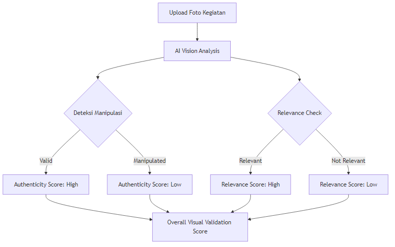

### 2.1.2 Framework Pengembangan AI

**AI Development Lifecycle (AIDL)** yang diimplementasikan:

1. **Data Strategy & Collection**
2. **Model Architecture Selection**
3. **Training & Validation**
4. **Testing & Evaluation**
5. **Deployment & Monitoring**
6. **Continuous Learning & Improvement**

## 2.2 Arsitektur Sistem Komprehensif

### 2.2.1 Overall System Architecture

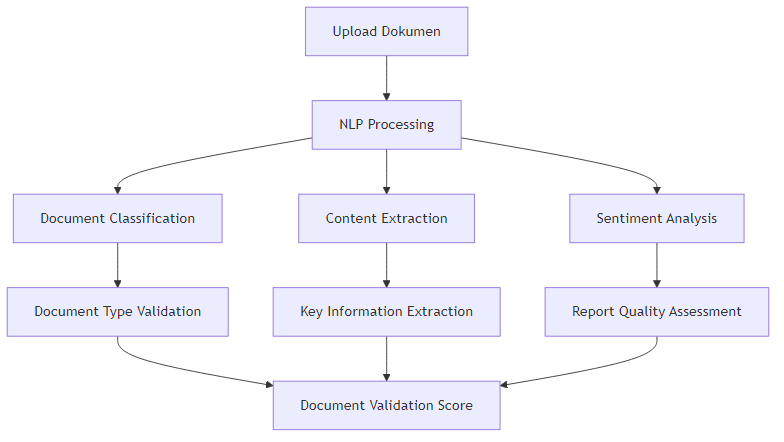

### 2.2.2 Data Flow Architecture

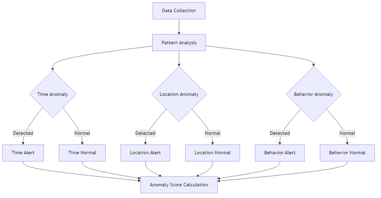

## 2.3 Solusi AI yang Ditawarkan

### 2.3.1 Computer Vision untuk Validasi Visual

#### A. Arsitektur Model Computer Vision

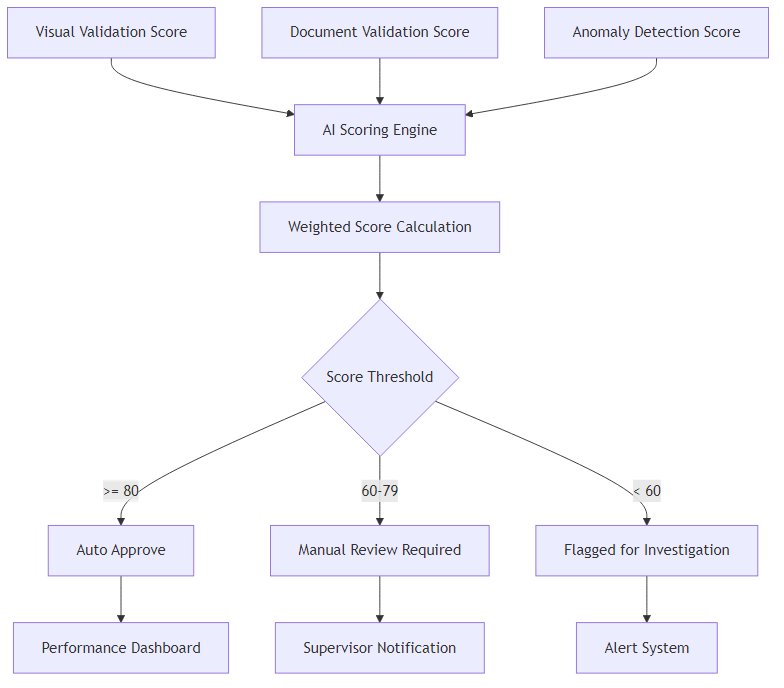

#### B. Teknik AI yang Digunakan

**1. Deepfake Detection:**

- **EfficientNet-B7** untuk feature extraction
- **Temporal Consistency Analysis** untuk video sequences
- **Frequency Domain Analysis** untuk detecting manipulation artifacts
- **Ensemble Method** combining multiple detection approaches

**2. Activity Recognition:**

- **YOLO v8** untuk object detection
- **ResNet-50** untuk activity classification
- **Spatial-Temporal Networks** untuk understanding context
- **Custom Dataset** trained on Indonesian government activities

**3. Metadata Validation:**

```python
# Pseudocode untuk Metadata Validation
def validate_metadata(image_path, reported_data):
    exif_data = extract_exif(image_path)
    
    # Timestamp validation
    timestamp_score = validate_timestamp(
        exif_data.timestamp, 
        reported_data.activity_time
    )
    
    # GPS validation
    gps_score = validate_location(
        exif_data.gps_coordinates,
        reported_data.activity_location
    )
    
    # Camera consistency
    device_score = validate_device_consistency(
        exif_data.camera_model,
        user_profile.registered_devices
    )
    
    return {
        'timestamp_score': timestamp_score,
        'location_score': gps_score,
        'device_score': device_score,
        'overall_metadata_score': calculate_weighted_average()
    }
```

### 2.3.2 Natural Language Processing untuk Analisis Dokumen

#### A. Arsitektur NLP Pipeline

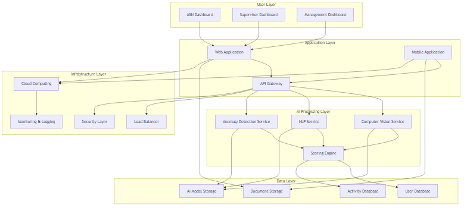

#### B. Model AI untuk NLP

**1. Document Classification:**

- **IndoBERT** fine-tuned untuk Indonesian government documents
- **Multi-label Classification** untuk multiple document types
- **Confidence Scoring** untuk uncertain classifications

**2. Named Entity Recognition (NER):**

```python
# Custom NER untuk Indonesian Government Context
class GovernmentNER:
    def __init__(self):
        self.entities = {
            'PERSON': ['nama_asn', 'nama_atasan', 'nama_peserta'],
            'LOCATION': ['tempat_kegiatan', 'alamat', 'kota'],
            'DATE': ['tanggal_kegiatan', 'deadline', 'periode'],
            'MONEY': ['biaya', 'anggaran', 'honorarium'],
            'ORGANIZATION': ['instansi', 'dinas', 'unit_kerja'],
            'ACTIVITY': ['jenis_kegiatan', 'program', 'proyek']
        }
    
    def extract_entities(self, text):
        # Implementation using spaCy with custom model
        return extracted_entities
    
    def validate_consistency(self, entities, reported_data):
        # Cross-validate extracted entities with reported data
        return consistency_score
```

**3. Content Quality Assessment:**

- **Readability Analysis** using Indonesian language metrics
- **Coherence Scoring** untuk logical flow assessment
- **Completeness Check** against required information template
- **Plagiarism Detection** using semantic similarity

### 2.3.3 Anomaly Detection untuk Monitoring Pola

#### A. Multi-dimensional Anomaly Detection

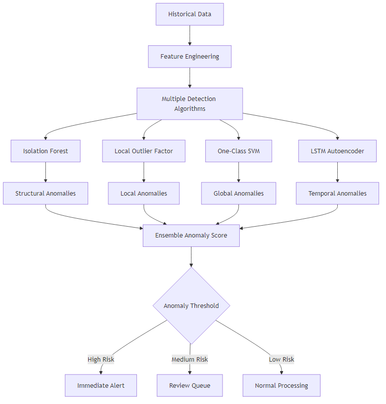

#### B. Implementasi Anomaly Detection

**1. Temporal Pattern Analysis:**

```python
class TemporalAnomalyDetector:
    def __init__(self):
        self.lstm_autoencoder = build_lstm_autoencoder()
        self.seasonal_decompose = SeasonalDecompose()
    
    def detect_time_anomalies(self, activity_data):
        # Analyze working hour patterns
        work_pattern = self.extract_work_patterns(activity_data)
        
        # Detect unusual timing
        reconstruction_error = self.lstm_autoencoder.predict(work_pattern)
        anomaly_score = calculate_reconstruction_error(reconstruction_error)
        
        # Seasonal analysis
        seasonal_anomalies = self.seasonal_decompose.detect_anomalies(
            activity_data.timestamps
        )
        
        return {
            'temporal_anomaly_score': anomaly_score,
            'seasonal_anomalies': seasonal_anomalies,
            'pattern_consistency': self.calculate_consistency()
        }
```

**2. Behavioral Pattern Analysis:**

- **Activity Frequency Analysis**
- **Location Pattern Recognition**
- **Collaboration Network Analysis**
- **Resource Usage Pattern Detection**

### 2.3.4 Integrated Scoring Engine

#### A. Multi-Criteria Decision Analysis (MCDA)

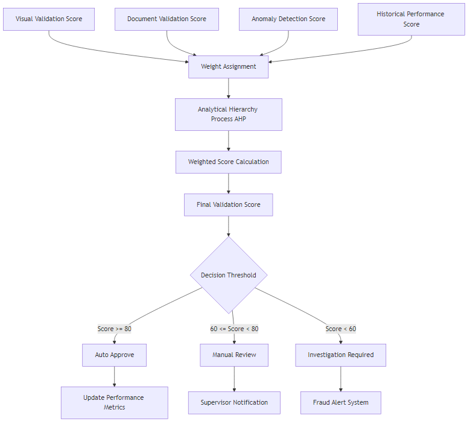

#### B. Dynamic Scoring Algorithm

```python
class DynamicScoringEngine:
    def __init__(self):
        self.weights = {
            'visual_validation': 0.3,
            'document_validation': 0.25,
            'anomaly_detection': 0.2,
            'historical_performance': 0.15,
            'peer_comparison': 0.1
        }
        self.learning_rate = 0.01
    
    def calculate_final_score(self, validation_results):
        # Multi-criteria scoring
        weighted_scores = []
        
        for criterion, score in validation_results.items():
            weight = self.weights.get(criterion, 0)
            weighted_score = score * weight
            weighted_scores.append(weighted_score)
        
        final_score = sum(weighted_scores)
        
        # Apply confidence interval
        confidence = self.calculate_confidence(validation_results)
        adjusted_score = final_score * confidence
        
        # Dynamic weight adjustment based on feedback
        self.update_weights(validation_results, feedback_data)
        
        return {
            'final_score': adjusted_score,
            'confidence': confidence,
            'breakdown': self.get_score_breakdown(validation_results)
        }
    
    def update_weights(self, results, feedback):
        # Reinforcement learning untuk weight optimization
        for criterion in self.weights:
            if feedback.get('criterion_effectiveness', {}).get(criterion):
                self.weights[criterion] += self.learning_rate
            else:
                self.weights[criterion] -= self.learning_rate
        
        # Normalize weights
        total_weight = sum(self.weights.values())
        self.weights = {k: v/total_weight for k, v in self.weights.items()}
```

## 2.4 Workflow Sistem dan User Experience

### 2.4.1 Complete System Workflow

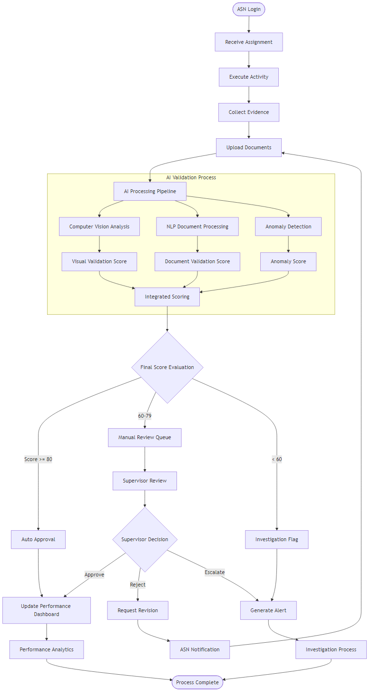

### 2.4.2 User Interface Wireframes

#### A. ASN Dashboard Wireframe (Mockflow Compatible)

**Layout Structure:**

gambar 1

#### B. Supervisor Dashboard Wireframe (Mockflow Compatible)

**Layout Structure:**
gambar 2


#### C. Management Analytics Dashboard (Mockflow Compatible)

**Layout Structure:**

gambar3


## 2.5 AI Model Training dan Optimization

### 2.5.1 Training Data Strategy

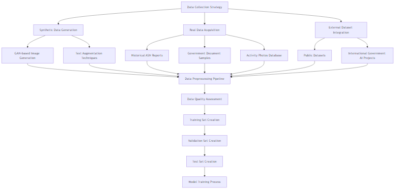

### 2.5.2 Continuous Learning Framework

```python
class ContinuousLearningFramework:
    def __init__(self):
        self.model_versions = {}
        self.performance_metrics = {}
        self.feedback_queue = []
        
    def update_model_with_feedback(self, model_name, feedback_data):
        """
        Implement continuous learning dari user feedback
        """
        # Collect feedback
        self.feedback_queue.append({
            'model': model_name,
            'feedback': feedback_data,
            'timestamp': datetime.now()
        })
        
        # Retrain model jika feedback threshold tercapai
        if len(self.feedback_queue) >= self.retrain_threshold:
            self.trigger_model_retraining(model_name)
    
    def model_performance_monitoring(self):
        """
        Monitor model performance dan trigger retraining jika perlu
        """
        for model_name, metrics in self.performance_metrics.items():
            if metrics['accuracy'] < self.performance_threshold:
                self.schedule_model_improvement(model_name)
    
    def a_b_testing_framework(self, model_a, model_b, traffic_split=0.5):
        """
        A/B testing untuk model comparison
        """
        return {
            'model_a_performance': self.evaluate_model(model_a),
            'model_b_performance': self.evaluate_model(model_b),
            'statistical_significance': self.calculate_significance(),
            'recommendation': self.get_deployment_recommendation()
        }
```

### 2.5.3 Model Interpretability dan Explainable AI

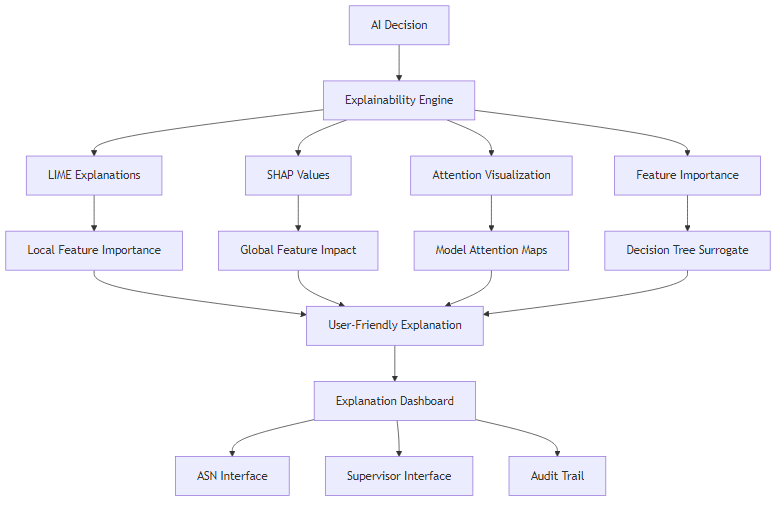

## 2.6 Security dan Compliance Framework

### 2.6.1 Security Architecture

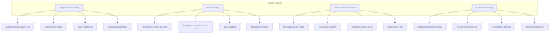

### 2.6.2 Compliance dan Audit Framework

```python
class ComplianceFramework:
    def __init__(self):
        self.regulations = [
            'UU_ASN_2014',
            'PP_30_2019',
            'GDPR_EQUIVALENT',
            'ISO_27001',
            'SOC_2'
        ]
        
    def generate_audit_trail(self, action, user, timestamp, details):
        """
        Generate comprehensive audit trail
        """
        audit_entry = {
            'action_id': generate_uuid(),
            'action_type': action,
            'user_id': user.id,
            'user_role': user.role,
            'timestamp': timestamp,
            'ip_address': get_client_ip(),
            'user_agent': get_user_agent(),
            'details': details,
            'hash': calculate_integrity_hash(),
            'compliance_flags': self.check_compliance_requirements(action)
        }
        
        # Store dalam immutable audit database
        self.store_audit_entry(audit_entry)
        
        # Generate compliance report jika diperlukan
        if self.requires_compliance_report(action):
            self.generate_compliance_report(audit_entry)
    
    def privacy_impact_assessment(self, data_processing_activity):
        """
        Assess privacy impact untuk data processing activities
        """
        return {
            'risk_level': self.calculate_privacy_risk(data_processing_activity),
            'mitigation_measures': self.suggest_privacy_measures(),
            'compliance_status': self.check_privacy_compliance(),
            'recommendations': self.generate_privacy_recommendations()
        }
```

## 2.7 Performance Optimization dan Scalability

### 2.7.1 System Performance Architecture

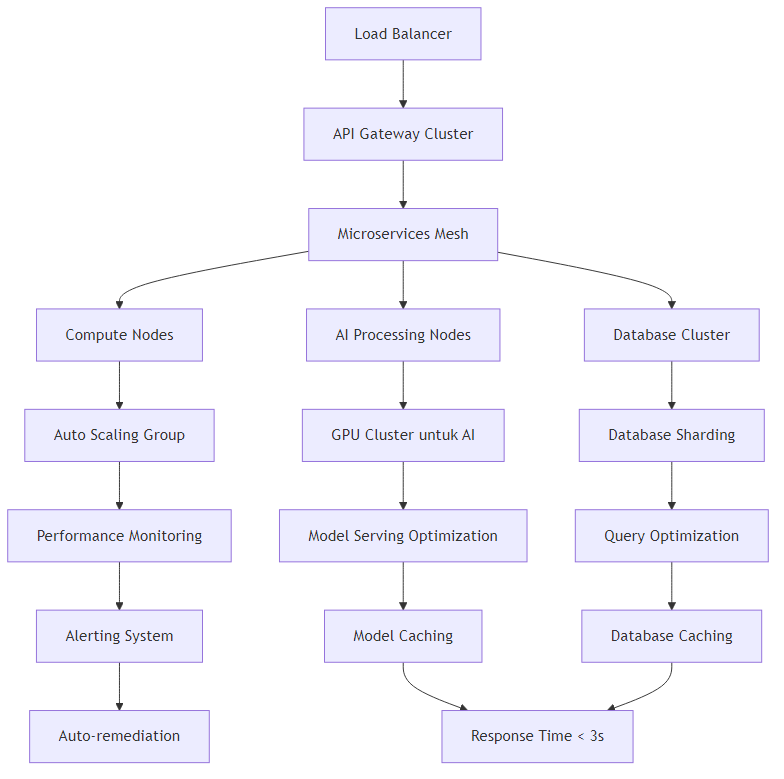

### 2.7.2 Caching Strategy

```python
class IntelligentCachingSystem:
    def __init__(self):
        self.cache_layers = {
            'l1_memory': RedisCache(),
            'l2_ssd': SSDCache(),
            'l3_object': ObjectStorageCache()
        }
        self.cache_policies = {
            'ai_models': {'ttl': 3600, 'layer': 'l1_memory'},
            'user_data': {'ttl': 1800, 'layer': 'l2_ssd'},
            'static_content': {'ttl': 86400, 'layer': 'l3_object'}
        }
    
    def intelligent_cache_decision(self, data_type, access_pattern):
        """
        AI-based caching decision
        """
        # Analyze access patterns
        access_frequency = self.analyze_access_frequency(data_type)
        data_size = self.calculate_data_size(data_type)
        computation_cost = self.estimate_computation_cost(data_type)
        
        # ML model untuk prediksi optimal caching strategy
        optimal_strategy = self.cache_ml_model.predict([
            access_frequency, data_size, computation_cost
        ])
        
        return {
            'cache_layer': optimal_strategy['layer'],
            'ttl': optimal_strategy['ttl'],
            'eviction_policy': optimal_strategy['eviction']
        }
```

## 2.8 Implementation Roadmap dan Testing Strategy

### 2.8.1 Phased Implementation Plan

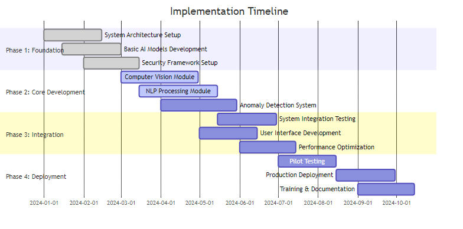

### 2.8.2 Comprehensive Testing Framework

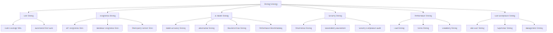

## 2.9 Advanced AI Reasoning dan Decision Making

### 2.9.1 Multi-Agent AI System Architecture

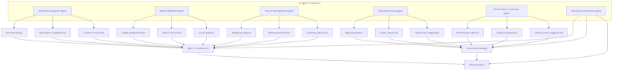

### 2.9.2 Reasoning Engine Implementation

```python
class AIReasoningEngine:
    def __init__(self):
        self.knowledge_base = GovernmentKnowledgeBase()
        self.rule_engine = FuzzyLogicRuleEngine()
        self.learning_module = ReinforcementLearningModule()
        
    def multi_modal_reasoning(self, document_data, image_data, metadata):
        """
        Advanced reasoning yang menggabungkan multiple modalities
        """
        # Stage 1: Individual Analysis
        doc_analysis = self.analyze_document_semantics(document_data)
        img_analysis = self.analyze_visual_content(image_data)
        meta_analysis = self.analyze_metadata_consistency(metadata)
        
        # Stage 2: Cross-modal Validation
        consistency_check = self.cross_modal_consistency_check(
            doc_analysis, img_analysis, meta_analysis
        )
        
        # Stage 3: Contextual Reasoning
        context_analysis = self.contextual_reasoning(
            document_data, image_data, metadata, 
            self.knowledge_base.get_context()
        )
        
        # Stage 4: Decision Making with Uncertainty Quantification
        decision = self.make_decision_with_uncertainty(
            doc_analysis, img_analysis, meta_analysis,
            consistency_check, context_analysis
        )
        
        return {
            'decision': decision,
            'confidence': decision.confidence,
            'reasoning_path': decision.reasoning_steps,
            'evidence': decision.supporting_evidence,
            'uncertainty': decision.uncertainty_bounds
        }
    
    def contextual_reasoning(self, document, image, metadata, context):
        """
        Reasoning berdasarkan konteks pemerintahan Indonesia
        """
        # Government activity classification
        activity_type = self.classify_government_activity(document, context)
        
        # Compliance check dengan regulasi
        compliance_status = self.check_regulatory_compliance(
            activity_type, document, context
        )
        
        # Historical pattern matching
        historical_patterns = self.match_historical_patterns(
            activity_type, metadata, context
        )
        
        # Stakeholder impact analysis
        stakeholder_impact = self.analyze_stakeholder_impact(
            activity_type, document, context
        )
        
        return {
            'activity_classification': activity_type,
            'compliance_status': compliance_status,
            'historical_alignment': historical_patterns,
            'stakeholder_impact': stakeholder_impact,
            'context_score': self.calculate_context_score()
        }
```

### 2.9.3 Explainable AI Decision Framework

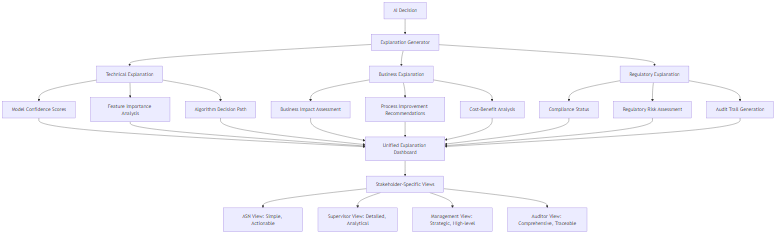

## 2.10 Advanced User Experience Design


## 2.11 Quality Assurance dan Monitoring Framework

### 2.11.1 Real-time System Monitoring

```python
class SystemMonitoringFramework:
    def __init__(self):
        self.metrics_collector = MetricsCollector()
        self.anomaly_detector = SystemAnomalyDetector()
        self.alert_manager = AlertManager()
        self.dashboard = RealTimeDashboard()
        
    def comprehensive_monitoring(self):
        """
        Comprehensive system monitoring dengan AI-powered insights
        """
        # Performance Metrics
        performance_metrics = {
            'response_time': self.measure_response_time(),
            'throughput': self.measure_throughput(),
            'error_rate': self.calculate_error_rate(),
            'resource_utilization': self.monitor_resources()
        }
        
        # AI Model Performance
        ai_metrics = {
            'model_accuracy': self.evaluate_model_accuracy(),
            'prediction_confidence': self.measure_prediction_confidence(),
            'drift_detection': self.detect_model_drift(),
            'bias_monitoring': self.monitor_model_bias()
        }
        
        # Business Metrics
        business_metrics = {
            'user_satisfaction': self.measure_user_satisfaction(),
            'process_efficiency': self.calculate_process_efficiency(),
            'fraud_detection_rate': self.measure_fraud_detection(),
            'cost_savings': self.calculate_cost_impact()
        }
        
        # Integrated Health Score
        health_score = self.calculate_system_health(
            performance_metrics, ai_metrics, business_metrics
        )
        
        # Predictive Alerts
        if self.anomaly_detector.predict_system_issues(health_score):
            self.alert_manager.trigger_preventive_alerts()
        
        return {
            'health_score': health_score,
            'performance': performance_metrics,
            'ai_performance': ai_metrics,
            'business_impact': business_metrics,
            'recommendations': self.generate_optimization_recommendations()
        }
```

### 2.11.2 Automated Quality Assurance Pipeline

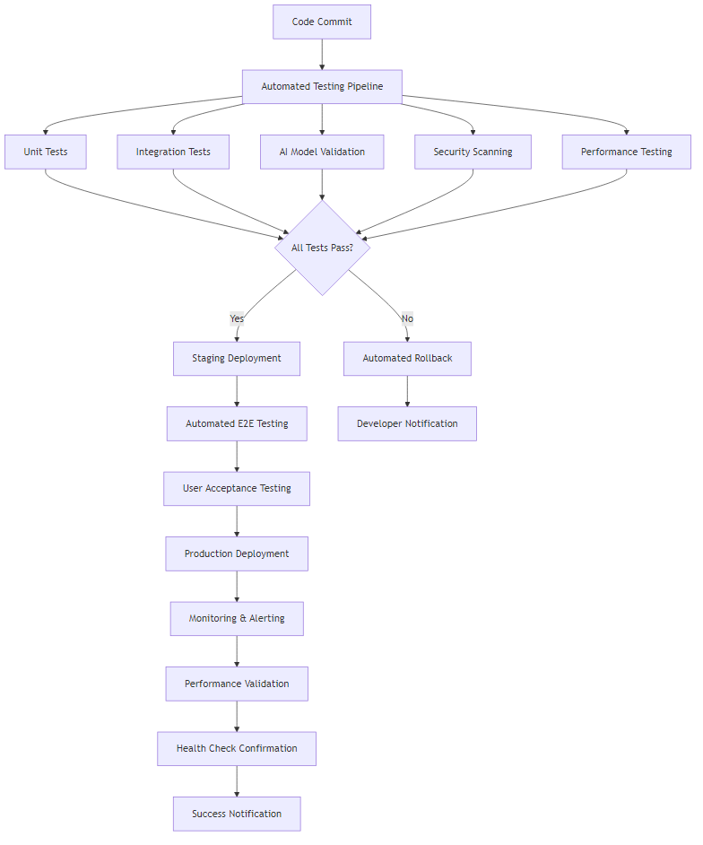

Dengan metodologi dan solusi yang komprehensif ini, sistem akan mampu memberikan validasi yang akurat, efisien, dan dapat diandalkan untuk kegiatan ASN, sambil mempertahankan standar keamanan dan compliance yang tinggi.