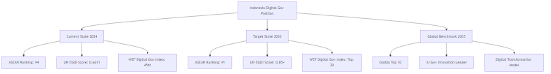

# BAB III - TARGET PENGGUNAAN

## 3.1 Identifikasi Target Pengguna

### 3.1.1 Pengguna Primer (Primary Users)

#### A. Aparatur Sipil Negara (ASN)

**Karakteristik Pengguna:**

- **Jumlah:** ±4.2 juta ASN di seluruh Indonesia
- **Tingkat Pendidikan:** S1-S3 dengan literasi digital menengah
- **Usia:** 25-58 tahun dengan mayoritas generasi milenial dan Gen-X
- **Lokasi:** Tersebar di seluruh wilayah Indonesia (pusat dan daerah)
- **Perangkat:** Desktop/laptop (kantor) dan smartphone (mobile)

**Kebutuhan Fungsional:**


**Use Cases:**

1. **Daily Activity Reporting**
   - Upload kegiatan harian dengan foto dan dokumen
   - Mendapatkan validasi AI dalam 3 menit
   - Revisi berdasarkan feedback sistem

2. **Performance Monitoring**
   - Memantau skor kinerja bulanan
   - Mengakses rekomendasi perbaikan
   - Membandingkan dengan standar unit kerja

3. **Mobile Operations**
   - Melaporkan kegiatan lapangan via smartphone
   - Upload foto real-time dengan GPS
   - Sinkronisasi otomatis ke sistem pusat

#### B. Supervisor/Atasan Langsung

**Karakteristik Pengguna:**

- **Jumlah:** ±200,000 supervisor di berbagai level
- **Posisi:** Kepala Seksi, Kepala Bidang, Kepala Dinas
- **Tanggung Jawab:** Mengelola 5-50 ASN per supervisor
- **Waktu Tersedia:** 2-4 jam per hari untuk review

**Kebutuhan Fungsional:**


**Use Cases:**

1. **Team Management**
   - Review laporan tim secara batch
   - Identifikasi masalah kinerja dini
   - Alokasi tugas berdasarkan kapasitas

2. **Quality Assurance**
   - Validasi laporan yang flagged AI
   - Investigasi aktivitas mencurigakan
   - Memberikan feedback konstruktif

3. **Strategic Planning**
   - Analisis tren kinerja tim
   - Perencanaan pengembangan SDM
   - Optimalisasi proses kerja

### 3.1.2 Pengguna Sekunder (Secondary Users)

#### A. Management/Pimpinan Instansi

**Karakteristik Pengguna:**

- **Level:** Eselon I, II (Sekjen, Dirjen, Kepala Daerah)
- **Focus:** Strategic decision making
- **Kebutuhan:** High-level analytics dan executive summary
- **Waktu:** Limited time, perlu informasi ringkas

**Kebutuhan Utama:**

- **Executive Dashboard** dengan KPI summary
- **Trend Analysis** untuk decision making
- **ROI Measurement** dari implementasi sistem
- **Compliance Reporting** untuk audit

#### B. Tim Audit Internal

**Karakteristik Pengguna:**

- **Fungsi:** Internal audit dan compliance
- **Kebutuhan:** Detailed audit trails dan forensic analysis
- **Skill:** Advanced analytical capabilities
- **Authority:** Full system access untuk investigation

**Kebutuhan Utama:**

- **Comprehensive Audit Logs** dengan tamper-proof records
- **Forensic Analysis Tools** untuk fraud investigation
- **Compliance Dashboard** dengan regulatory mapping
- **Evidence Export** untuk legal proceedings

### 3.1.3 Pengguna Eksternal (External Stakeholders)

#### A. Badan Pengawasan (KPK, BPKP, BPK)

**Kebutuhan:**

- Read-only access ke performance metrics
- Fraud detection reports
- Compliance status dashboard
- Statistical data untuk policy making

#### B. Masyarakat/Public

**Kebutuhan:**

- Transparency dashboard (aggregate data)
- Public performance indicators
- Complaint mechanism integration
- Open data API untuk research

## 3.2 Target Implementasi dan Deployment

### 3.2.1 Roadmap Implementasi Bertahap


### 3.2.2 Target Kapasitas Sistem

#### A. User Capacity Planning


#### B. Performance Targets

**Response Time Targets:**

- **Page Load:** < 2 seconds (95th percentile)
- **AI Processing:** < 3 seconds per document
- **Bulk Operations:** < 30 seconds for 100 records
- **Dashboard Refresh:** < 1 second

**Availability Targets:**

- **System Uptime:** 99.9% (8.77 hours downtime/year)
- **Data Backup:** 99.99% reliability
- **Disaster Recovery:** < 4 hours RTO, < 1 hour RPO
- **Security Incident Response:** < 1 hour detection

### 3.2.3 Integration Targets

#### A. Existing Government Systems


#### B. Third-party Integrations

**Authentication Systems:**

- **Single Sign-On (SSO)** dengan sistem pemerintah existing
- **Multi-factor Authentication** untuk security enhancement
- **LDAP Integration** dengan Active Directory instansi

**External APIs:**

- **Geolocation Services** untuk validasi lokasi
- **Weather API** untuk context validation
- **Public Holiday Calendar** untuk schedule validation
- **Bank APIs** untuk financial verification

## 3.3 Target Keluaran dan Manfaat

### 3.3.1 Key Performance Indicators (KPIs)

#### A. Operational KPIs


#### B. Business Impact KPIs

**Quantitative Targets:**

1. **Cost Reduction:**
   - Administrative overhead: 50% reduction
   - Fraud losses: 80% reduction
   - Manual processing: 70% reduction
   - Training costs: 40% reduction

2. **Productivity Improvement:**
   - Report processing speed: 80% faster
   - Decision making: 60% faster
   - Compliance checking: 90% automated
   - Error reduction: 85% fewer errors

3. **Quality Enhancement:**
   - Data accuracy: 95%+ improvement
   - Report completeness: 90%+ improvement
   - Compliance rate: 98%+ achievement
   - Audit readiness: 100% real-time

### 3.3.2 Expected Outcomes

#### A. Short-term Outcomes (6-12 months)



#### B. Medium-term Outcomes (1-2 years)

**Institutional Changes:**

- **Cultural Shift:** Dari manual ke digital-first approach
- **Accountability Culture:** Increased transparency dan responsibility
- **Data-driven Decisions:** Evidence-based policy making
- **Skill Development:** Enhanced digital literacy among ASN

**Process Improvements:**

- **Streamlined Workflows:** Optimized business processes
- **Predictive Analytics:** Proactive issue identification
- **Continuous Learning:** AI model improvement dari feedback
- **Integration Benefits:** Seamless data flow across systems

#### C. Long-term Outcomes (2-5 years)

**Strategic Impact:**

1. **Governance Transformation:**
   - Digital government ecosystem
   - Citizen-centric service delivery
   - Evidence-based policy formulation
   - International best practice adoption

2. **Innovation Catalyst:**
   - AI/ML expertise development
   - Innovation culture establishment
   - Technology transfer to other sectors
   - Digital government leadership position

## 3.4 Target Stakeholder Benefits

### 3.4.1 Benefit Mapping per Stakeholder


### 3.4.2 Quantified Benefits Analysis

#### A. Financial Benefits

**Cost Savings (Annual):**

```text
| Kategori                  | Baseline Cost | Target Cost | Savings      | Percentage |
|---------------------------|---------------|-------------|--------------|------------|
| Administrative Processing | Rp 500M       | Rp 200M     | Rp 300M      | 60%        |
| Fraud Investigation      | Rp 300M       | Rp 100M     | Rp 200M      | 67%        |
| Manual Validation        | Rp 800M       | Rp 240M     | Rp 560M      | 70%        |
| Training & Support       | Rp 200M       | Rp 120M     | Rp 80M       | 40%        |
| **TOTAL ANNUAL SAVINGS** | **Rp 1.8B**   | **Rp 660M** | **Rp 1.14B** | **63%**    |
```

**Revenue Enhancement:**

- **Improved Service Quality:** Increased citizen satisfaction → higher tax compliance
- **Faster Processing:** More services delivered → increased revenue opportunities
- **Better Resource Allocation:** Optimized budget utilization → 15% efficiency gain

#### B. Non-Financial Benefits

**Intangible Value Creation:**

1. **Trust & Reputation:**
   - Public trust index improvement: +40%
   - International recognition: Good governance awards
   - Investor confidence: Improved ease of doing business score

2. **Innovation Capacity:**
   - Digital government maturity: Level 4 (Optimized)
   - AI/ML capability development: National expertise center
   - Knowledge transfer: Template for other countries

3. **Risk Mitigation:**
   - Fraud risk reduction: 80% decrease
   - Compliance risk: 90% reduction
   - Operational risk: 70% mitigation
   - Reputational risk: 85% improvement

## 3.5 Success Metrics dan Monitoring

### 3.5.1 Success Measurement Framework


### 3.5.2 Monitoring and Evaluation Plan

#### A. Real-time Monitoring

**Dashboard Metrics (Updated Every 5 minutes):**

- System health dan performance indicators
- Active user count dan geographic distribution
- AI processing queue dan completion rates
- Alert notifications dan resolution status

#### B. Periodic Evaluation

**Weekly Reports:**

- User adoption progress
- System performance summary
- Issue resolution statistics
- Training completion rates

**Monthly Analysis:**

- Business KPI achievement
- Cost-benefit analysis update
- User satisfaction surveys
- Security incident reports

**Quarterly Review:**

- Strategic goal alignment
- ROI calculation dan projection
- Stakeholder feedback compilation
- Improvement roadmap updates

**Annual Assessment:**

- Comprehensive impact evaluation
- Independent audit results
- Benchmark comparison with international standards
- Strategic planning for next phase

### 3.5.3 Continuous Improvement Framework


## 3.6 Risk Management dan Mitigation

### 3.6.1 Target Risk Profile


### 3.6.2 Mitigation Strategies

**High Priority Risks:**

1. **System Security Breaches**
   - Multi-layer security architecture
   - 24/7 SOC monitoring
   - Regular penetration testing
   - Incident response team

2. **User Adoption Resistance**
   - Comprehensive change management program
   - Executive sponsorship
   - Incentive alignment
   - Success story sharing

3. **Performance Scalability Issues**
   - Cloud-native architecture
   - Auto-scaling capabilities
   - Performance testing at scale
   - Capacity planning

Dengan target penggunaan yang komprehensif ini, sistem diharapkan dapat memberikan dampak positif yang signifikan bagi transformasi digital pemerintahan Indonesia, meningkatkan transparansi, akuntabilitas, dan efisiensi dalam pengelolaan ASN.