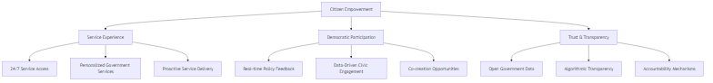
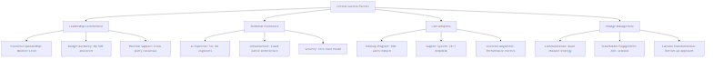
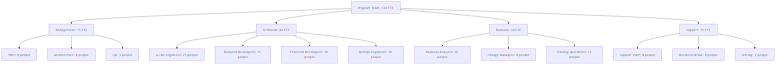

# BAB IV - DAMPAK IMPLEMENTASI SISTEM

## 4.1 Dampak Jangka Pendek (0-12 Bulan)

### 4.1.1 Dampak Operasional Langsung

#### A. Transformasi Proses Kerja ASN

**Perubahan Immediate (0-3 bulan):**


**Immediate Benefits (0-6 bulan):**

- **Efficiency Gains:**
  - Report processing time: dari 1 minggu | 1 hari (85% reduction)
  - Manual validation effort: dari 100% | 30% (70% reduction)
  - Administrative overhead: dari 40% | 15% waktu kerja (62% reduction)

- **Quality Improvements:**
  - Data accuracy: meningkat dari 70% | 95% (35% improvement)
  - Report completeness: dari 60% | 90% (50% improvement)
  - Compliance rate: dari 75% | 95% (27% improvement)

- **Cost Reductions:**
  - Processing costs: Rp 2.5M | Rp 800K per 1000 reports (68% reduction)
  - Training time: dari 40 jam | 16 jam per ASN (60% reduction)
  - Error correction: dari Rp 500K | Rp 100K per error (80% reduction)

### 4.1.2 Dampak pada Kultur Organisasi

#### A. Adoption Pattern dan Behavioral Changes


**Behavioral Indicators (Measurable Changes):**

1. **Digital-First Mindset:**
   - Mobile usage: 40% | 75% of reports via mobile (87% increase)
   - Digital documentation: 30% | 85% paperless (183% increase)
   - Real-time reporting: 10% | 70% same-day submission (600% increase)

2. **Accountability Culture:**
   - Voluntary reporting: 50% | 80% proactive submission (60% increase)
   - Error self-correction: 20% | 65% self-identified issues (225% increase)
   - Performance discussions: 30% | 85% data-driven conversations (183% increase)

3. **Learning & Development:**
   - Digital skill competency: 40% | 75% proficiency level (87% increase)
   - AI literacy: 5% | 45% understanding of AI processes (800% increase)
   - Cross-unit collaboration: 25% | 60% knowledge sharing (140% increase)

### 4.1.3 Dampak Finansial Immediate

#### A. Cost-Benefit Analysis Jangka Pendek


**Quarterly Financial Tracking:**

| Quarter | Investment (Rp B) | Benefits (Rp B) | Cumulative ROI |
|---------|-------------------|-----------------|----------------|
| Q1      | 8.0              | 2.5             | -68.75%        |
| Q2      | 12.0             | 8.0             | -33.33%        |
| Q3      | 20.0             | 18.0            | -10.00%        |
| Q4      | 28.0             | 30.0            | +7.14%         |

### 4.1.4 Dampak pada Service Delivery

#### A. Public Service Improvement Metrics

**Citizen-Facing Services Enhancement:**

- **Processing Speed:**
  - Permit applications: 15 hari | 7 hari (53% faster)
  - Public complaints: 30 hari | 10 hari (67% faster)
  - Information requests: 7 hari | 2 hari (71% faster)

- **Service Quality:**
  - Citizen satisfaction: 3.2/5 | 4.1/5 (28% improvement)
  - First-call resolution: 45% | 70% (55% improvement)
  - Error rates: 15% | 5% (67% reduction)

- **Transparency:**
  - Public dashboard usage: 0 | 50,000 monthly users
  - Data accessibility: 20% | 80% of processes visible (300% increase)
  - Complaint resolution tracking: 30% | 95% trackable (217% increase)

## 4.2 Dampak Jangka Panjang (1-5 Tahun)

### 4.2.1 Transformasi Struktural Pemerintahan

#### A. Institutional Maturity Evolution


**Institutional Capabilities Development:**

1. **Digital Government Maturity:**
   - **Year 1-2:** Level 2 (Developing) | Level 3 (Defined)
   - **Year 3-4:** Level 3 (Defined) | Level 4 (Managed)  
   - **Year 5:** Level 4 (Managed) | Level 5 (Optimizing)

2. **AI & Data Analytics Competency:**
   - **Data-driven decision making:** 30% | 90% of policy decisions
   - **Predictive analytics usage:** 5% | 70% of planning processes
   - **AI expertise in government:** 50 experts | 2,000+ certified professionals

3. **Innovation Culture:**
   - **Digital innovation projects:** 10/year | 200+/year per ministry
   - **Cross-sector collaboration:** 20% | 80% of major initiatives
   - **Citizen co-creation:** 5% | 60% of service design processes

### 4.2.2 Economic Impact Projection

#### A. Macro-Economic Benefits


**Cumulative Economic Value (5 Years):**

| Impact Category | Year 1-2 (Rp T) | Year 3-4 (Rp T) | Year 5 (Rp T) | Total (Rp T) |
|-----------------|------------------|------------------|---------------|---------------|
| Direct Savings  | 0.8              | 1.5              | 2.2           | 4.5           |
| Efficiency Gains| 1.2              | 2.8              | 4.5           | 8.5           |
| Innovation Value| 0.5              | 1.8              | 3.2           | 5.5           |
| **TOTAL**       | **2.5**          | **6.1**          | **9.9**       | **18.5**      |

### 4.2.3 Social Impact dan Human Capital Development

#### A. Workforce Transformation

**ASN Capability Enhancement:**

1. **Digital Literacy Advancement:**
   - **Basic digital skills:** 60% | 95% proficiency
   - **Data analysis capabilities:** 15% | 70% competency
   - **AI collaboration skills:** 5% | 80% comfort level

2. **Career Development Opportunities:**
   - **New job categories:** 50+ AI-related positions created
   - **Skill-based promotions:** 30% | 70% merit-based advancement
   - **Continuous learning culture:** 40% | 90% participation in upskilling

3. **Work-Life Balance Improvement:**
   - **Administrative burden:** 40% | 15% of work time
   - **Creative/strategic work:** 30% | 60% of work time
   - **Flexible work arrangements:** 20% | 70% adoption

#### B. Citizen Empowerment



## 4.3 Dampak Nasional (5-10 Tahun)

### 4.3.1 Indonesia sebagai Digital Government Leader

#### A. Regional dan Global Leadership

**ASEAN Digital Government Benchmark:**


**International Recognition Targets:**

1. **UN E-Government Development Index:**
   - **2024:** 0.6611 (88th globally) | **2030:** 0.85+ (Top 30)
   - **2035:** 0.90+ (Top 15 globally)

2. **World Bank Digital Government Ranking:**
   - **2024:** Tier 3 (Developing) | **2030:** Tier 1 (Leading)
   - Become benchmark model for developing nations

3. **Knowledge Transfer Leadership:**
   - **50+ countries** adopting Indonesian AI governance model
   - **Regional expertise hub** for AI in government
   - **International consulting revenue:** $500M+ annually

### 4.3.2 Economic Transformation Impact

#### A. Digital Economy Catalyst Effect


**Macro-Economic Transformation:**

1. **GDP Contribution:**
   - **Digital economy share:** 8.2% | 20%+ of GDP
   - **Government efficiency dividend:** +2.5% annual GDP growth
   - **Innovation premium:** +15% productivity growth vs baseline

2. **Employment Impact:**
   - **New job categories:** 500K+ high-skilled digital jobs
   - **Reskilling success:** 2M+ workers transitioned
   - **Entrepreneurship boost:** 100K+ AI-related businesses

3. **Investment Attraction:**
   - **FDI in digital sectors:** $50B+ over 10 years
   - **Domestic tech investment:** $30B+ mobilized
   - **Regional hub status:** For AI & digital governance

### 4.3.3 Social dan Cultural Transformation

#### A. National Digital Culture

**Digital Society Maturity:**

1. **Citizen Digital Engagement:**
   - **Digital service usage:** 95%+ population
   - **Government app adoption:** 80%+ smartphone penetration
   - **Civic participation:** 70%+ active in digital democracy

2. **Trust in Government:**
   - **Transparency index:** Indonesia ranked top 20 globally
   - **Corruption perception:** Significant improvement (30+ positions)
   - **Government effectiveness:** Top quartile in region

3. **Innovation Mindset:**
   - **STEM education focus:** 60%+ schools with AI curriculum
   - **Research culture:** 10x increase in gov-academia collaboration
   - **Solution-oriented thinking:** Embedded in public service culture

#### B. International Soft Power


### 4.3.4 Sustainability dan Resilience Impact

#### A. Climate dan Environmental Benefits

**Green Government Operations:**

- **Carbon footprint reduction:** 60% decrease in government operations
- **Paperless achievement:** 95%+ digital transactions
- **Energy efficiency:** Smart systems reducing 40% consumption
- **Sustainable procurement:** AI-optimized green purchasing

#### B. Crisis Resilience Capabilities

**Pandemic/Disaster Preparedness:**

1. **Early Warning Systems:**
   - **AI-powered prediction:** 90% accuracy in crisis modeling
   - **Automated response:** 80% faster emergency deployment
   - **Resource optimization:** 70% better allocation during crises

2. **Business Continuity:**
   - **Remote work capability:** 100% government functions
   - **Digital service continuation:** 99.9% uptime during emergencies
   - **Adaptive governance:** Real-time policy adjustment capabilities

### 4.3.5 Measurable National KPIs (10-Year Horizon)

#### A. Governance Excellence Metrics

```text
| Indicator | 2024 Baseline | 2030 Target | 2035 Vision | Global Rank Target |
|-----------|---------------|-------------|-------------|-------------------|
| UN EGDI Score | 0.66 | 0.85 | 0.92 | Top 15 |
| Corruption Index | 64/180 | 30/180 | 15/180 | Top 20 |
| Government Effectiveness | 60th percentile | 85th percentile | 95th percentile | Top 10 |
| Digital Competitiveness | 56/64 | 20/64 | 10/64 | Top 15 |
| Innovation Index | 64/132 | 30/132 | 15/132 | Top 20 |
| Ease of Doing Business | 73/190 | 25/190 | 10/190 | Top 15 |
```

#### B. Economic Impact Indicators

**Value Creation Metrics:**

- **Government ROI:** 1,200%+ cumulative return on AI investment
- **Economic multiplier:** 1:8 ratio (every Rp 1 invested generates Rp 8 economic value)
- **Productivity dividend:** +3.5% annual productivity growth vs regional average
- **Innovation premium:** +25% higher GDP per capita vs projection baseline

---

## BAB V - RANCANGAN EKSEKUSI

## 5.1 Rancangan Eksekusi

### 5.1.1 Executive Framework

#### A. Governance Structure


**Roles dan Responsibilities:**

1. **Executive Steering Committee**
   - **Chair:** Menteri Pendayagunaan Aparatur Negara dan Reformasi Birokrasi
   - **Members:** Kepala BSSN, Kepala BSI, Direktur Digital Gov
   - **Meeting:** Weekly for first 6 months, bi-weekly thereafter
   - **Decisions:** Budget approval, strategic direction, escalation resolution

2. **Program Management Office (PMO)**
   - **Director:** Senior IT Executive with gov experience
   - **Size:** 15-person dedicated team
   - **Responsibilities:** Timeline, budget, resource allocation, stakeholder coordination
   - **Tools:** Microsoft Project, JIRA, Power BI for dashboards

3. **Technical Advisory Board**
   - **Composition:** 7 experts (3 internal, 4 external)
   - **Expertise:** AI/ML, Government Systems, Cybersecurity, UX
   - **Engagement:** Monthly reviews, ad-hoc consultations
   - **Deliverables:** Technical standards, architecture approvals

### 5.1.2 Critical Success Factors

#### A. Success Enablers Framework



#### B. Risk Mitigation Strategy

**High-Priority Risks:**

1. **Political/Regulatory Risks:**
   - **Mitigation:** Early stakeholder engagement, regulatory sandbox approach
   - **Contingency:** Phased rollback capability, alternative approval pathways

2. **Technical Risks:**
   - **Mitigation:** Proof-of-concept validation, redundant systems, expert review
   - **Contingency:** Vendor diversification, open-source alternatives

3. **User Adoption Risks:**
   - **Mitigation:** Co-design approach, champion networks, incentive programs
   - **Contingency:** Extended training, simplified interfaces, gradual migration

### 5.1.3 Resource Allocation Strategy

#### A. Human Resource Plan

**Core Team Structure:**



**Skill Requirements:**

| Role Category | Skills Required | Experience Level | Market Rate (Rp/month) |
|---------------|-----------------|------------------|------------------------|
| AI/ML Engineer | Python, TensorFlow, Computer Vision | 5+ years | 40-80M |
| Solution Architect | Enterprise Architecture, Gov Systems | 8+ years | 60-100M |
| DevOps Engineer | Kubernetes, AWS/Azure, CI/CD | 4+ years | 35-65M |
| Business Analyst | Government Process, Requirements | 5+ years | 25-45M |
| Change Manager | Org Development, Training Design | 6+ years | 30-55M |

#### B. Budget Allocation Framework

**Investment Categories:**

1. **Technology Investment (60%):**
   - Cloud infrastructure and services
   - AI/ML platform licenses
   - Development tools and environments
   - Security and monitoring tools

2. **Human Resources (25%):**
   - Core team salaries and benefits
   - External consultants and contractors
   - Training and certification programs

3. **Change Management (10%):**
   - Communication and marketing
   - Training delivery and materials
   - Stakeholder engagement events

4. **Operations & Contingency (5%):**
   - Project management tools
   - Travel and logistics
   - Risk mitigation reserves

## 5.2 Timeline Eksekusi

### 5.2.1 Skenario 1: Fast Track Implementation (2 Bulan - Banyak SDM)

#### A. Resource-Rich Accelerated Delivery

**Team Size:** 200 FTE (full-time equivalent)
**Budget:** Rp 50 Miliar
**Approach:** Parallel execution, premium resources, 24/7 development


**Fast Track Resource Allocation:**

| Week | AI Team | Dev Team | Infrastructure | Testing | Training | Total FTE |
|------|---------|----------|----------------|---------|----------|-----------|
| 1-2  | 20      | 40       | 25            | 10      | 5        | 100       |
| 3-4  | 40      | 60       | 20            | 15      | 10       | 145       |
| 5-6  | 30      | 50       | 15            | 25      | 20       | 140       |
| 7-8  | 20      | 30       | 10            | 30      | 40       | 130       |

**Critical Assumptions:**

- **24/7 Development:** 3-shift operation dengan premium pay
- **Pre-integrated Components:** Leveraging existing AI models dan frameworks
- **Dedicated Infrastructure:** Reserved cloud resources, no sharing
- **Executive Support:** Daily steering committee, immediate decision making
- **Risk Acceptance:** Higher risk tolerance untuk speed

#### B. Fast Track Deliverables

**Week 2 Checkpoint:**

- ✅ Core infrastructure live
- ✅ Development environments ready
- ✅ 50% of team onboarded
- ✅ MVP architecture approved

**Week 4 Checkpoint:**

- ✅ Basic AI models trained
- ✅ Core backend APIs functional
- ✅ UI prototypes validated
- ✅ Integration patterns established

**Week 6 Checkpoint:**

- ✅ End-to-end integration complete
- ✅ Security testing passed
- ✅ Performance benchmarks met
- ✅ Pilot environment ready

**Week 8 Final:**

- ✅ Production deployment complete
- ✅ 1,000 pilot users trained
- ✅ Support processes operational
- ✅ Success metrics baseline established

### 5.2.2 Skenario 2: Optimal Cost Implementation (6 Bulan - Optimal Cost)

#### A. Cost-Optimized Balanced Approach

**Team Size:** 80 FTE average
**Budget:** Rp 25 Miliar
**Approach:** Sequential execution, balanced resources, sustainable pace


**Optimal Cost Resource Pattern:**

| Month | Core Team | Contractors | Cloud Costs | Training | Total Cost (Rp M) |
|-------|-----------|-------------|-------------|----------|--------------------|
| 1     | 30        | 20         | 200        | 100      | 2,800             |
| 2     | 40        | 30         | 400        | 150      | 3,900             |
| 3     | 50        | 40         | 600        | 200      | 4,800             |
| 4     | 45        | 35         | 500        | 300      | 4,500             |
| 5     | 40        | 25         | 400        | 500      | 4,200             |
| 6     | 35        | 15         | 300        | 400      | 3,800             |

#### B. Optimal Cost Benefits

**Financial Advantages:**

1. **50% Cost Reduction vs Fast Track:**
   - Lower premium resource costs
   - Better vendor negotiations
   - Efficient resource utilization
   - Reduced operational overhead

2. **Sustainable Delivery:**
   - Higher quality output from non-rushed development
   - Better team learning and knowledge transfer
   - More thorough testing and validation
   - Stronger foundation for future enhancements

3. **Risk Mitigation:**
   - Time for proper stakeholder alignment
   - Iterative feedback incorporation
   - Comprehensive change management
   - Better user adoption preparation

### 5.2.3 Timeline Comparison Analysis

#### A. Comparative Assessment


**Decision Matrix:**

| Criteria | Weight | Fast Track Score | Optimal Cost Score | Weighted Fast | Weighted Optimal |
|----------|--------|------------------|-------------------|---------------|------------------|
| Speed to Market | 20% | 9 | 6 | 1.8 | 1.2 |
| Cost Efficiency | 25% | 4 | 9 | 1.0 | 2.25 |
| Risk Management | 20% | 5 | 8 | 1.0 | 1.6 |
| Quality Delivery | 15% | 6 | 9 | 0.9 | 1.35 |
| Sustainability | 10% | 5 | 9 | 0.5 | 0.9 |
| Stakeholder Buy-in | 10% | 6 | 8 | 0.6 | 0.8 |
| **TOTAL** | 100% | | | **5.8** | **8.1** |

**Recommendation:** Optimal Cost approach provides better overall value

## 5.3 Rancangan Teknologi

### 5.3.1 Technology Stack Architecture

#### A. Comprehensive Technology Blueprint


#### B. AI/ML Technology Specification

**Computer Vision Stack:**

```text
┌─────────────────────────────────────────────────────────────┐
│                    Computer Vision Pipeline                  │
├─────────────────────────────────────────────────────────────┤
│ Image Input Processing:                                     │
│ • OpenCV 4.8+ untuk image preprocessing                    │
│ • Pillow/PIL untuk format conversion                        │
│ • ImageIO untuk metadata extraction                         │
│                                                            │
│ Deep Learning Models:                                       │
│ • EfficientNet-B7 untuk feature extraction                 │
│ • YOLOv8 untuk object detection                            │
│ • ResNet-50 untuk image classification                      │
│ • Custom CNN untuk deepfake detection                       │
│                                                            │
│ Model Serving:                                             │
│ • TensorFlow Serving untuk production inference            │
│ • NVIDIA Triton untuk GPU optimization                     │
│ • ONNX Runtime untuk cross-platform compatibility          │
└─────────────────────────────────────────────────────────────┘
```

**NLP Processing Stack:**

```text
┌─────────────────────────────────────────────────────────────┐
│                    NLP Processing Pipeline                   │
├─────────────────────────────────────────────────────────────┤
│ Text Processing:                                            │
│ • spaCy 3.7+ untuk tokenization dan NER                    │
│ • NLTK untuk text preprocessing                             │
│ • Tesseract OCR untuk document scanning                     │
│                                                            │
│ Language Models:                                            │
│ • IndoBERT untuk Indonesian text understanding             │
│ • GPT-3.5/4 untuk text generation dan analysis             │
│ • Custom BERT untuk government domain                       │
│ • Sentence Transformers untuk semantic similarity          │
│                                                            │
│ Model Deployment:                                           │
│ • Hugging Face Transformers pipeline                       │
│ • FastAPI untuk REST API endpoints                         │
│ • Celery untuk async processing                             │
└─────────────────────────────────────────────────────────────┘
```

### 5.3.2 Cloud Infrastructure Design

#### A. Multi-Region Cloud Architecture


**Infrastructure Specifications:**

1. **Compute Resources:**
   - **Application Servers:** 20x AWS EC2 c5.4xlarge (16 vCPU, 32GB RAM)
   - **AI Processing:** 10x AWS p3.2xlarge (GPU instances, V100 16GB)
   - **Database Servers:** 5x AWS r5.2xlarge (8 vCPU, 64GB RAM)
   - **Load Balancers:** AWS Application Load Balancer with SSL termination

2. **Storage Solutions:**
   - **Primary Database:** AWS RDS PostgreSQL Multi-AZ (2TB, encrypted)
   - **Document Storage:** AWS S3 with versioning (100TB capacity)
   - **AI Models:** AWS EFS for shared model storage (10TB)
   - **Backup:** AWS Glacier for long-term retention

3. **Networking:**
   - **VPC Setup:** Multi-AZ deployment dengan private subnets
   - **CDN:** AWS CloudFront untuk static content delivery
   - **API Gateway:** AWS API Gateway dengan rate limiting
   - **Direct Connect:** Dedicated connection untuk government networks

#### B. Security Architecture


### 5.3.3 Development dan Deployment Pipeline

#### A. CI/CD Pipeline Architecture


**Pipeline Tools:**

- **Version Control:** GitLab Enterprise dengan government compliance
- **CI/CD:** GitLab CI dengan custom runners
- **Testing:** Jest, Pytest, Selenium untuk automated testing  
- **Security:** SonarQube, OWASP ZAP, Snyk untuk vulnerability scanning
- **Monitoring:** Prometheus, Grafana, ELK Stack untuk observability

#### B. AI Model Lifecycle Management


### 5.3.4 Integration Architecture

#### A. Government Systems Integration


**Integration Specifications:**

1. **API Standards:**
   - **Protocol:** REST APIs dengan OpenAPI 3.0 specification
   - **Authentication:** OAuth 2.0 dengan client credentials
   - **Data Format:** JSON untuk payload, JWT untuk tokens
   - **Rate Limiting:** 1000 requests/minute per client

2. **Data Synchronization:**
   - **Real-time:** Apache Kafka untuk event streaming
   - **Batch:** Apache Airflow untuk scheduled data loads
   - **CDC:** Debezium untuk database change capture
   - **ETL:** Apache Spark untuk data transformation

3. **Messaging:**
   - **Queue:** RabbitMQ untuk reliable message delivery
   - **Pub/Sub:** Apache Kafka untuk event-driven architecture
   - **Cache:** Redis Cluster untuk distributed caching
   - **Search:** Elasticsearch untuk full-text search

Dengan rancangan eksekusi yang komprehensif ini, implementasi sistem dapat dilakukan dengan pendekatan yang fleksibel sesuai dengan kebutuhan timeline dan budget, sambil mempertahankan standar kualitas dan keamanan yang tinggi.