# BAB I - PENDAHULUAN

## 1.1 Latar Belakang

Aparatur Sipil Negara (ASN) merupakan tulang punggung pelayanan publik yang berperan vital dalam menjalankan fungsi pemerintahan. Dalam era digital dan tuntutan good governance yang semakin tinggi, akuntabilitas dan transparansi kinerja ASN menjadi fokus utama reformasi birokrasi. Penilaian kinerja ASN yang objektif, terukur, dan dapat dipertanggungjawabkan merupakan kunci untuk meningkatkan kualitas pelayanan publik.

Perkembangan teknologi Artificial Intelligence (AI) dan machine learning telah membuka peluang besar untuk transformasi digital dalam berbagai sektor, termasuk manajemen SDM pemerintahan. Teknologi AI dapat dimanfaatkan untuk mengotomatisasi proses validasi kegiatan, mendeteksi anomali, dan memberikan penilaian yang objektif berdasarkan data dan bukti yang tersedia.

Sistem tradisional penilaian kinerja ASN yang masih mengandalkan pelaporan manual dan validasi konvensional seringkali menghadapi berbagai tantangan seperti subjektivitas penilaian, keterbatasan sumber daya untuk monitoring, dan potensi manipulasi data. Oleh karena itu, dibutuhkan sebuah sistem inovatif yang dapat mengintegrasikan teknologi AI untuk meningkatkan efektivitas, efisiensi, dan akuntabilitas dalam penilaian kinerja ASN.

Sistem Validasi Kegiatan ASN berbasis AI hadir sebagai solusi komprehensif yang menggabungkan berbagai teknologi canggih seperti Computer Vision, Natural Language Processing (NLP), dan Anomaly Detection untuk memberikan validasi otomatis terhadap laporan kegiatan ASN. Sistem ini tidak hanya meningkatkan akurasi penilaian tetapi juga mendorong transparansi dan kultur kerja yang lebih profesional di lingkungan birokrasi.

## 1.2 Permasalahan

### 1.2.1 Penggelapan Dana dan Manipulasi Keuangan

Salah satu permasalahan serius dalam pelaksanaan kegiatan ASN adalah potensi penggelapan dana operasional dan manipulasi laporan keuangan. Beberapa indikasi permasalahan ini meliputi:

- **Manipulasi kwitansi dan bukti pengeluaran** yang tidak sesuai dengan kegiatan sebenarnya
- **Double claiming** atau pengajuan klaim ganda untuk kegiatan yang sama
- **Mark-up biaya operasional** yang tidak proporsional dengan output kegiatan
- **Penggunaan dana untuk kegiatan pribadi** yang disamarkan sebagai kegiatan dinas
- **Kesulitan tracking penggunaan dana** secara real-time dan transparan

### 1.2.2 Manipulasi Pekerjaan dan Laporan Kegiatan

Sistem pelaporan manual yang ada saat ini rentan terhadap berbagai bentuk manipulasi, antara lain:

- **Pemalsuan dokumentasi kegiatan** seperti foto-foto yang tidak autentik atau diambil dari sumber lain
- **Laporan kegiatan fiktif** yang tidak pernah dilaksanakan secara nyata
- **Manipulasi lokasi dan waktu pelaksanaan** kegiatan untuk menutupi ketidakhadiran
- **Copy-paste laporan** dari kegiatan sebelumnya atau dari ASN lain
- **Exaggeration output kegiatan** yang tidak sesuai dengan realitas di lapangan

### 1.2.3 Kurang Optimalnya Jam Kerja

Permasalahan efektivitas jam kerja ASN mencakup beberapa aspek:

- **Absensi tidak akurat** yang tidak mencerminkan produktivitas sebenarnya
- **Kegiatan non-produktif** selama jam kerja yang sulit dideteksi
- **Ketidaksesuaian antara jam kerja dan output** yang dihasilkan
- **Fleksibilitas jam kerja** yang disalahgunakan untuk kepentingan pribadi
- **Lack of real-time monitoring** terhadap aktivitas ASN di lapangan

### 1.2.4 Ketidakseimbangan Beban Pekerjaan

Distribusi beban kerja yang tidak merata menimbulkan berbagai permasalahan:

- **Overload pada ASN tertentu** sementara yang lain underutilized
- **Kesulitan mengukur kompleksitas** dan tingkat kesulitan setiap jenis kegiatan
- **Ketidakadilan dalam penugasan** berdasarkan kompetensi dan kapasitas
- **Burnout dan penurunan kualitas kerja** akibat beban berlebih
- **Demotivasi ASN** yang merasa tidak dihargai kontribusinya

## 1.3 Harapan, Dampak, dan Solusi

### 1.3.1 Harapan dari Sistem Validasi Kegiatan ASN berbasis AI

**Harapan Jangka Pendek:**

- Transparansi penuh dalam pelaporan kegiatan ASN
- Deteksi otomatis terhadap laporan yang mencurigakan atau tidak valid
- Efisiensi proses validasi dan penilaian kinerja
- Standardisasi format dan kualitas laporan kegiatan

**Harapan Jangka Menengah:**

- Peningkatan akuntabilitas dan integritas ASN
- Optimalisasi alokasi sumber daya dan beban kerja
- Kultur kerja berbasis data dan evidences
- Peningkatan kualitas pelayanan publik

**Harapan Jangka Panjang:**

- Transformasi digital menyeluruh dalam manajemen ASN
- Benchmark system untuk lembaga pemerintah lainnya
- Kontribusi signifikan terhadap reformasi birokrasi
- Model governance yang dapat diadopsi secara nasional

### 1.3.2 Dampak Positif yang Diharapkan

**Dampak bagi ASN:**

- Penilaian kinerja yang objektif dan adil
- Feedback konstruktif untuk pengembangan karier
- Motivasi untuk meningkatkan kualitas kerja
- Perlindungan terhadap tuduhan tidak berdasar

**Dampak bagi Atasan/Supervisor:**

- Tools monitoring yang powerful dan real-time
- Dasar pengambilan keputusan yang akurat
- Efisiensi waktu dalam proses evaluasi
- Identifikasi early warning untuk permasalahan potensial

**Dampak bagi Lembaga:**

- Peningkatan kredibilitas dan trust publik
- Optimalisasi budget dan resource allocation
- Compliance terhadap regulasi dan audit
- Benchmark kinerja yang terukur dan comparable

**Dampak bagi Masyarakat:**

- Pelayanan publik yang lebih berkualitas
- Transparansi penggunaan anggaran negara
- Kepercayaan terhadap institusi pemerintah
- Partisipasi aktif dalam pengawasan publik

### 1.3.3 Solusi Teknologi AI yang Ditawarkan

#### A. Computer Vision untuk Validasi Visual

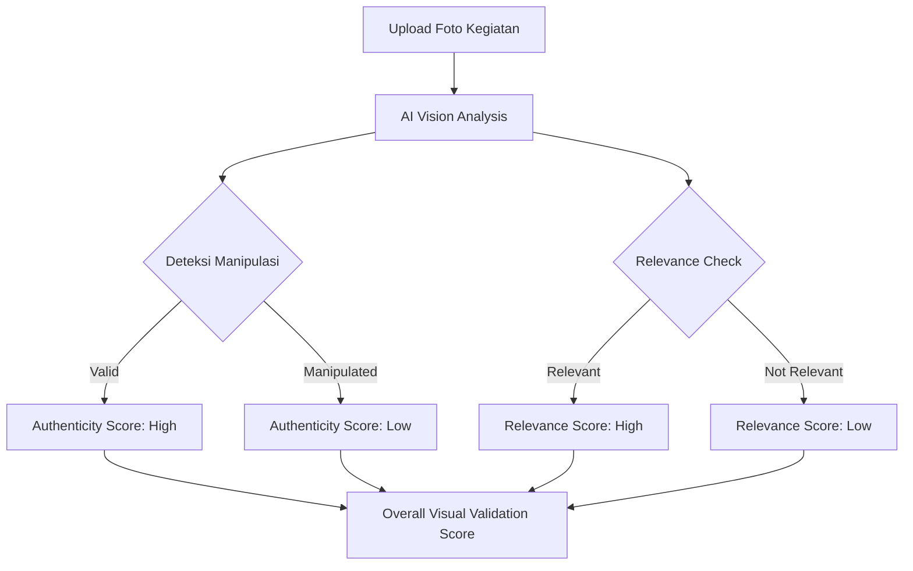
```mermaid
graph TD
    A[Upload Foto Kegiatan] --> B[AI Vision Analysis]
    B --> C{Deteksi Manipulasi}
    C -->|Valid| D[Authenticity Score: High]
    C -->|Manipulated| E[Authenticity Score: Low]
    B --> F{Relevance Check}
    F -->|Relevant| G[Relevance Score: High]
    F -->|Not Relevant| H[Relevance Score: Low]
    D --> I[Overall Visual Validation Score]
    E --> I
    G --> I
    H --> I
```

**Fitur Utama:**

- Deteksi foto manipulasi dan deepfake
- Verifikasi keaslian timestamp dan metadata
- Pengenalan objek dan aktivitas dalam foto
- Validasi kesesuaian lokasi dengan GPS data

#### B. Natural Language Processing untuk Analisis Dokumen

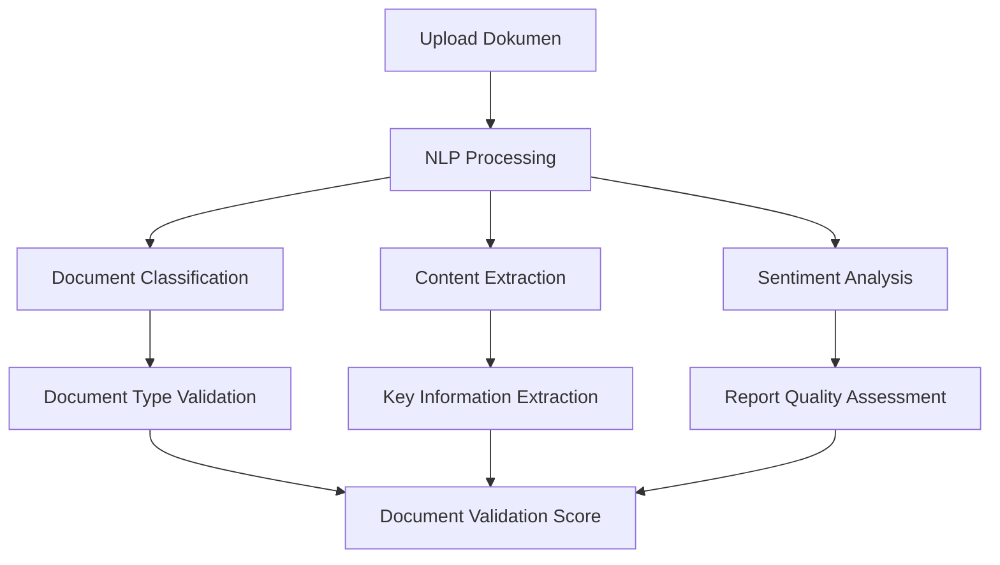
```mermaid
graph TD
    A[Upload Dokumen] --> B[NLP Processing]
    B --> C[Document Classification]
    B --> D[Content Extraction]
    B --> E[Sentiment Analysis]
    C --> F[Document Type Validation]
    D --> G[Key Information Extraction]
    E --> H[Report Quality Assessment]
    F --> I[Document Validation Score]
    G --> I
    H --> I
```

**Fitur Utama:**

- Klasifikasi otomatis jenis dokumen
- Ekstraksi informasi kunci dari laporan
- Deteksi plagiarisme dan duplikasi konten
- Analisis kualitas dan kelengkapan laporan

#### C. Anomaly Detection untuk Monitoring Pola

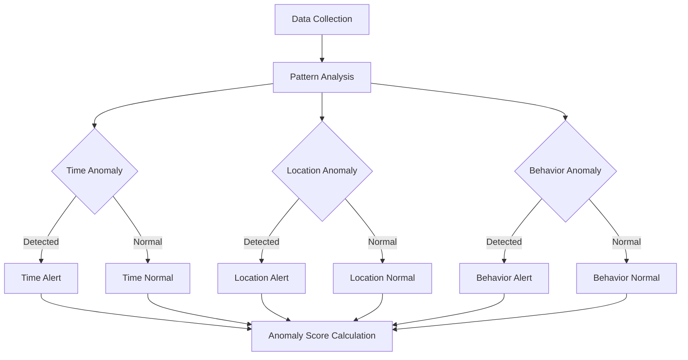
```mermaid
graph TD
    A[Data Collection] --> B[Pattern Analysis]
    B --> C{Time Anomaly}
    B --> D{Location Anomaly}
    B --> E{Behavior Anomaly}
    C -->|Detected| F[Time Alert]
    C -->|Normal| G[Time Normal]
    D -->|Detected| H[Location Alert]
    D -->|Normal| I[Location Normal]
    E -->|Detected| J[Behavior Alert]
    E -->|Normal| K[Behavior Normal]
    F --> L[Anomaly Score Calculation]
    G --> L
    H --> L
    I --> L
    J --> L
    K --> L
```

**Fitur Utama:**

- Deteksi pola kegiatan yang tidak wajar
- Monitoring jam kerja dan produktivitas
- Identifikasi outlier dalam pelaporan
- Prediksi potensi fraud berdasarkan historical data

#### D. Integrated Scoring System

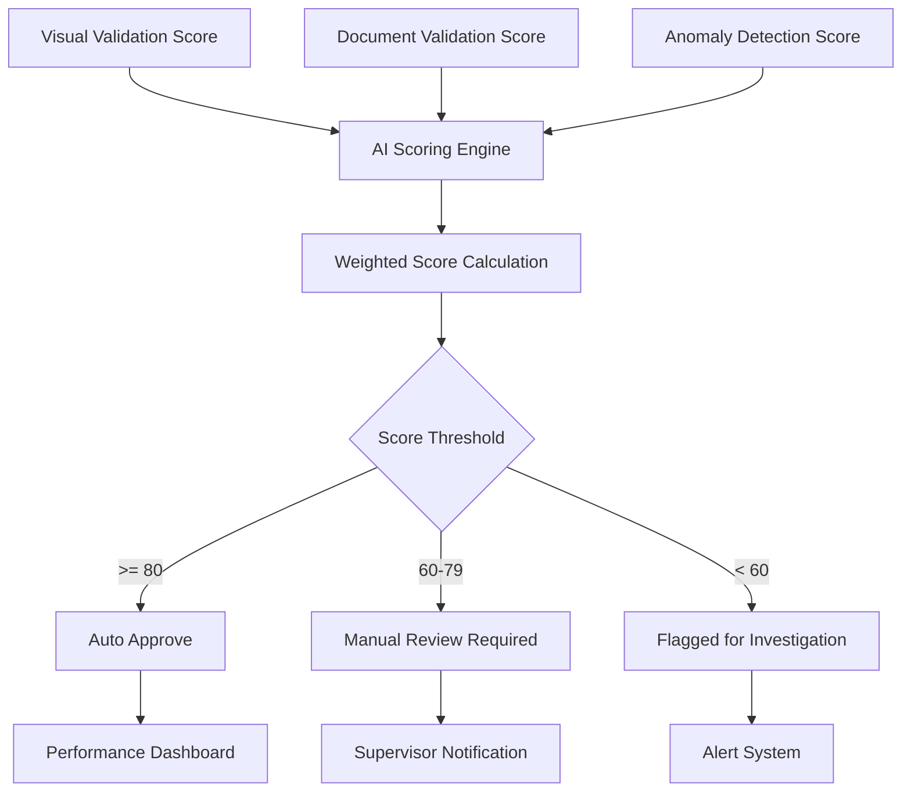
```mermaid
graph TD
    A[Visual Validation Score] --> D[AI Scoring Engine]
    B[Document Validation Score] --> D
    C[Anomaly Detection Score] --> D
    D --> E[Weighted Score Calculation]
    E --> F{Score Threshold}
    F -->|>= 80| G[Auto Approve]
    F -->|60-79| H[Manual Review Required]
    F -->|< 60| I[Flagged for Investigation]
    G --> J[Performance Dashboard]
    H --> K[Supervisor Notification]
    I --> L[Alert System]
```

**Komponen Scoring:**

- Validity Score (0-100): Mengukur keaslian dan akurasi laporan
- Fraud Risk Score (0-100): Mengidentifikasi potensi kecurangan
- Performance Score (0-100): Menilai kualitas output kegiatan
- Compliance Score (0-100): Mengukur kepatuhan terhadap prosedur

### 1.3.4 Arsitektur Sistem dan Requirement Analysis

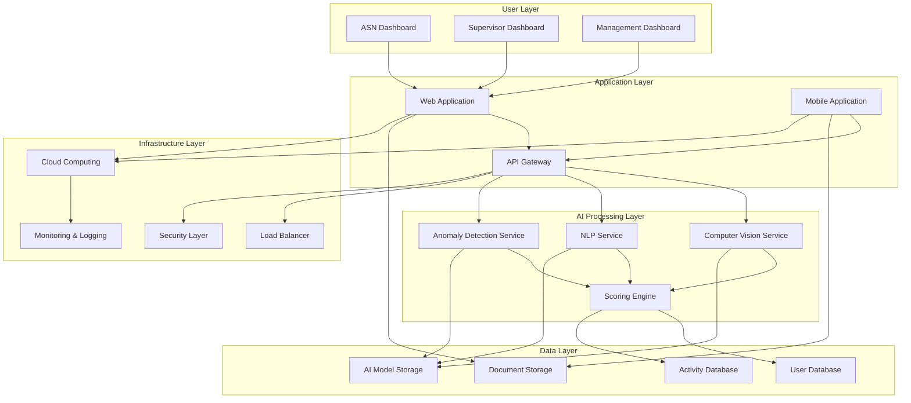
```mermaid
graph TB
    subgraph "User Layer"
        A[ASN Dashboard]
        B[Supervisor Dashboard]
        C[Management Dashboard]
    end
    
    subgraph "Application Layer"
        D[Web Application]
        E[Mobile Application]
        F[API Gateway]
    end
    
    subgraph "AI Processing Layer"
        G[Computer Vision Service]
        H[NLP Service]
        I[Anomaly Detection Service]
        J[Scoring Engine]
    end
    
    subgraph "Data Layer"
        K[User Database]
        L[Activity Database]
        M[Document Storage]
        N[AI Model Storage]
    end
    
    subgraph "Infrastructure Layer"
        O[Cloud Computing]
        P[Load Balancer]
        Q[Security Layer]
        R[Monitoring & Logging]
    end
    
    A --> D
    B --> D
    C --> D
    D --> F
    E --> F
    F --> G
    F --> H
    F --> I
    G --> J
    H --> J
    I --> J
    J --> K
    J --> L
    D --> M
    E --> M
    G --> N
    H --> N
    I --> N
    
    D --> O
    E --> O
    F --> P
    F --> Q
    O --> R
```

**System Requirements:**

- **Performance**: Response time < 3 detik untuk validasi real-time
- **Scalability**: Mampu menangani 10,000+ concurrent users
- **Availability**: Uptime 99.9% dengan disaster recovery
- **Security**: End-to-end encryption dan multi-factor authentication
- **Compliance**: Sesuai dengan regulasi pemerintah dan audit trail

Dengan implementasi sistem ini, diharapkan dapat tercipta lingkungan kerja ASN yang lebih transparan, akuntabel, dan efisien, serta memberikan kontribusi positif terhadap reformasi birokrasi dan peningkatan kualitas pelayanan publik di Indonesia.

# BAB II - METODOLOGI DAN SOLUSI YANG DITAWARKAN

## 2.1 Metodologi Pengembangan Sistem

### 2.1.1 Pendekatan Metodologi

Pengembangan Sistem Validasi Kegiatan ASN berbasis AI menggunakan **metodologi hybrid** yang menggabungkan **Design Thinking**, **Agile Development**, dan **AI-First Approach** untuk memastikan solusi yang user-centric, iteratif, dan berbasis kecerdasan buatan.

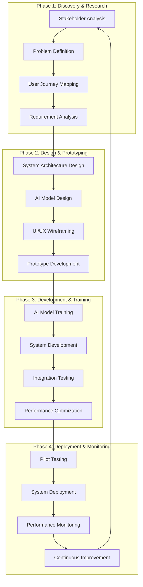
```mermaid
graph TB
    subgraph "Phase 1: Discovery & Research"
        A1[Stakeholder Analysis] --> A2[Problem Definition]
        A2 --> A3[User Journey Mapping]
        A3 --> A4[Requirement Analysis]
    end
    
    subgraph "Phase 2: Design & Prototyping"
        B1[System Architecture Design] --> B2[AI Model Design]
        B2 --> B3[UI/UX Wireframing]
        B3 --> B4[Prototype Development]
    end
    
    subgraph "Phase 3: Development & Training"
        C1[AI Model Training] --> C2[System Development]
        C2 --> C3[Integration Testing]
        C3 --> C4[Performance Optimization]
    end
    
    subgraph "Phase 4: Deployment & Monitoring"
        D1[Pilot Testing] --> D2[System Deployment]
        D2 --> D3[Performance Monitoring]
        D3 --> D4[Continuous Improvement]
    end
    
    A4 --> B1
    B4 --> C1
    C4 --> D1
    D4 --> A1
```

### 2.1.2 Framework Pengembangan AI

**AI Development Lifecycle (AIDL)** yang diimplementasikan:

1. **Data Strategy & Collection**
2. **Model Architecture Selection**
3. **Training & Validation**
4. **Testing & Evaluation**
5. **Deployment & Monitoring**
6. **Continuous Learning & Improvement**

## 2.2 Arsitektur Sistem Komprehensif

### 2.2.1 Overall System Architecture

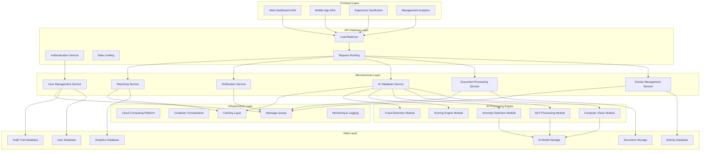
```mermaid
graph TB
    subgraph "Frontend Layer"
        F1[Web Dashboard ASN]
        F2[Mobile App ASN]
        F3[Supervisor Dashboard]
        F4[Management Analytics]
    end
    
    subgraph "API Gateway Layer"
        G1[Authentication Service]
        G2[Load Balancer]
        G3[Rate Limiting]
        G4[Request Routing]
    end
    
    subgraph "Microservices Layer"
        M1[User Management Service]
        M2[Activity Management Service]
        M3[Document Processing Service]
        M4[AI Validation Service]
        M5[Notification Service]
        M6[Reporting Service]
    end
    
    subgraph "AI Processing Engine"
        AI1[Computer Vision Module]
        AI2[NLP Processing Module]
        AI3[Anomaly Detection Module]
        AI4[Scoring Engine Module]
        AI5[Fraud Detection Module]
    end
    
    subgraph "Data Layer"
        D1[User Database]
        D2[Activity Database]
        D3[Document Storage]
        D4[AI Model Storage]
        D5[Analytics Database]
        D6[Audit Trail Database]
    end
    
    subgraph "Infrastructure Layer"
        I1[Cloud Computing Platform]
        I2[Container Orchestration]
        I3[Message Queue]
        I4[Caching Layer]
        I5[Monitoring & Logging]
    end
    
    F1 --> G2
    F2 --> G2
    F3 --> G2
    F4 --> G2
    
    G1 --> M1
    G2 --> G4
    G4 --> M2
    G4 --> M3
    G4 --> M4
    G4 --> M5
    G4 --> M6
    
    M4 --> AI1
    M4 --> AI2
    M4 --> AI3
    M4 --> AI4
    M4 --> AI5
    
    M1 --> D1
    M2 --> D2
    M3 --> D3
    AI1 --> D4
    AI2 --> D4
    AI3 --> D4
    M6 --> D5
    M1 --> D6
    
    M1 --> I3
    M2 --> I3
    M3 --> I3
    M4 --> I4
    M5 --> I3
    M6 --> I4
```

### 2.2.2 Data Flow Architecture

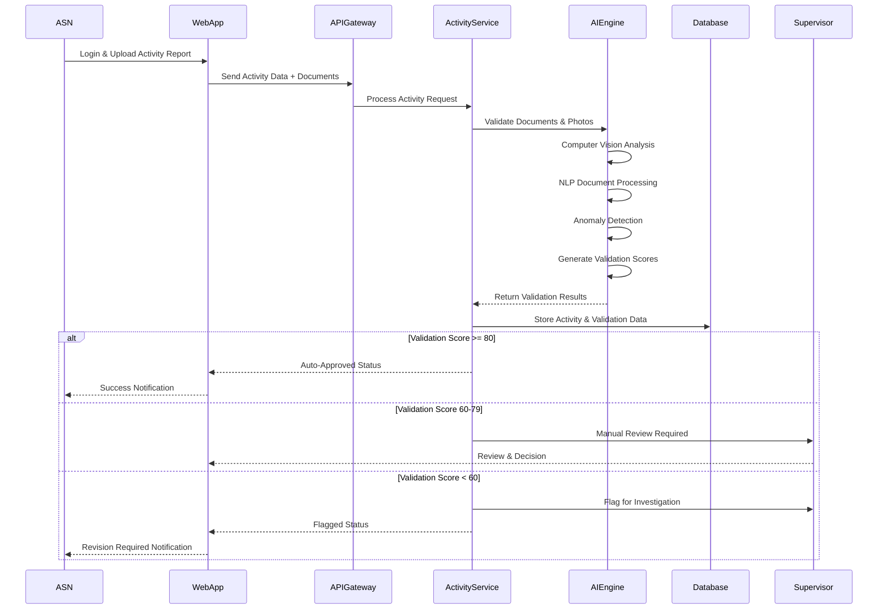
```mermaid
sequenceDiagram
    participant ASN
    participant WebApp
    participant APIGateway
    participant ActivityService
    participant AIEngine
    participant Database
    participant Supervisor
    
    ASN->>WebApp: Login & Upload Activity Report
    WebApp->>APIGateway: Send Activity Data + Documents
    APIGateway->>ActivityService: Process Activity Request
    
    ActivityService->>AIEngine: Validate Documents & Photos
    AIEngine->>AIEngine: Computer Vision Analysis
    AIEngine->>AIEngine: NLP Document Processing
    AIEngine->>AIEngine: Anomaly Detection
    AIEngine->>AIEngine: Generate Validation Scores
    
    AIEngine-->>ActivityService: Return Validation Results
    ActivityService->>Database: Store Activity & Validation Data
    
    alt Validation Score >= 80
        ActivityService-->>WebApp: Auto-Approved Status
        WebApp-->>ASN: Success Notification
    else Validation Score 60-79
        ActivityService->>Supervisor: Manual Review Required
        Supervisor-->>WebApp: Review & Decision
    else Validation Score < 60
        ActivityService->>Supervisor: Flag for Investigation
        ActivityService-->>WebApp: Flagged Status
        WebApp-->>ASN: Revision Required Notification
    end
```

## 2.3 Solusi AI yang Ditawarkan

### 2.3.1 Computer Vision untuk Validasi Visual

#### A. Arsitektur Model Computer Vision

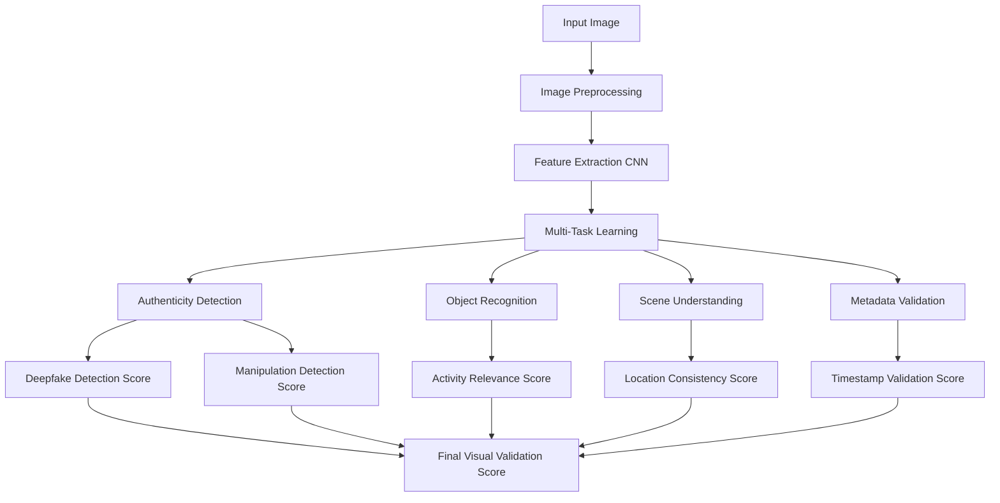
```mermaid
graph TD
    A[Input Image] --> B[Image Preprocessing]
    B --> C[Feature Extraction CNN]
    C --> D[Multi-Task Learning]
    
    D --> E[Authenticity Detection]
    D --> F[Object Recognition]
    D --> G[Scene Understanding]
    D --> H[Metadata Validation]
    
    E --> I[Deepfake Detection Score]
    E --> J[Manipulation Detection Score]
    F --> K[Activity Relevance Score]
    G --> L[Location Consistency Score]
    H --> M[Timestamp Validation Score]
    
    I --> N[Final Visual Validation Score]
    J --> N
    K --> N
    L --> N
    M --> N
```

#### B. Teknik AI yang Digunakan

**1. Deepfake Detection:**

- **EfficientNet-B7** untuk feature extraction
- **Temporal Consistency Analysis** untuk video sequences
- **Frequency Domain Analysis** untuk detecting manipulation artifacts
- **Ensemble Method** combining multiple detection approaches

**2. Activity Recognition:**

- **YOLO v8** untuk object detection
- **ResNet-50** untuk activity classification
- **Spatial-Temporal Networks** untuk understanding context
- **Custom Dataset** trained on Indonesian government activities

**3. Metadata Validation:**

```python
# Pseudocode untuk Metadata Validation
def validate_metadata(image_path, reported_data):
    exif_data = extract_exif(image_path)
    
    # Timestamp validation
    timestamp_score = validate_timestamp(
        exif_data.timestamp, 
        reported_data.activity_time
    )
    
    # GPS validation
    gps_score = validate_location(
        exif_data.gps_coordinates,
        reported_data.activity_location
    )
    
    # Camera consistency
    device_score = validate_device_consistency(
        exif_data.camera_model,
        user_profile.registered_devices
    )
    
    return {
        'timestamp_score': timestamp_score,
        'location_score': gps_score,
        'device_score': device_score,
        'overall_metadata_score': calculate_weighted_average()
    }
```

### 2.3.2 Natural Language Processing untuk Analisis Dokumen

#### A. Arsitektur NLP Pipeline

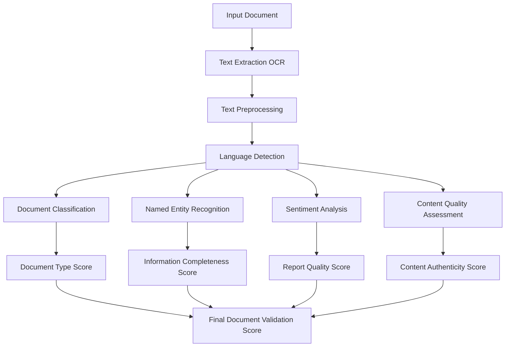
```mermaid
graph TD
    A[Input Document] --> B[Text Extraction OCR]
    B --> C[Text Preprocessing]
    C --> D[Language Detection]
    
    D --> E[Document Classification]
    D --> F[Named Entity Recognition]
    D --> G[Sentiment Analysis]
    D --> H[Content Quality Assessment]
    
    E --> I[Document Type Score]
    F --> J[Information Completeness Score]
    G --> K[Report Quality Score]
    H --> L[Content Authenticity Score]
    
    I --> M[Final Document Validation Score]
    J --> M
    K --> M
    L --> M
```

#### B. Model AI untuk NLP

**1. Document Classification:**

- **IndoBERT** fine-tuned untuk Indonesian government documents
- **Multi-label Classification** untuk multiple document types
- **Confidence Scoring** untuk uncertain classifications

**2. Named Entity Recognition (NER):**

```python
# Custom NER untuk Indonesian Government Context
class GovernmentNER:
    def __init__(self):
        self.entities = {
            'PERSON': ['nama_asn', 'nama_atasan', 'nama_peserta'],
            'LOCATION': ['tempat_kegiatan', 'alamat', 'kota'],
            'DATE': ['tanggal_kegiatan', 'deadline', 'periode'],
            'MONEY': ['biaya', 'anggaran', 'honorarium'],
            'ORGANIZATION': ['instansi', 'dinas', 'unit_kerja'],
            'ACTIVITY': ['jenis_kegiatan', 'program', 'proyek']
        }
    
    def extract_entities(self, text):
        # Implementation using spaCy with custom model
        return extracted_entities
    
    def validate_consistency(self, entities, reported_data):
        # Cross-validate extracted entities with reported data
        return consistency_score
```

**3. Content Quality Assessment:**

- **Readability Analysis** using Indonesian language metrics
- **Coherence Scoring** untuk logical flow assessment
- **Completeness Check** against required information template
- **Plagiarism Detection** using semantic similarity

### 2.3.3 Anomaly Detection untuk Monitoring Pola

#### A. Multi-dimensional Anomaly Detection

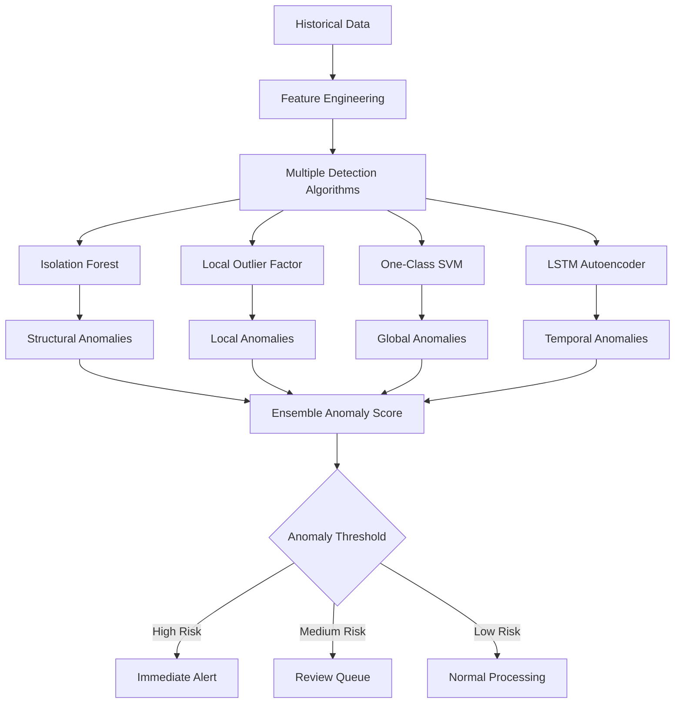
```mermaid
graph TD
    A[Historical Data] --> B[Feature Engineering]
    B --> C[Multiple Detection Algorithms]
    
    C --> D[Isolation Forest]
    C --> E[Local Outlier Factor]
    C --> F[One-Class SVM]
    C --> G[LSTM Autoencoder]
    
    D --> H[Structural Anomalies]
    E --> I[Local Anomalies]
    F --> J[Global Anomalies]
    G --> K[Temporal Anomalies]
    
    H --> L[Ensemble Anomaly Score]
    I --> L
    J --> L
    K --> L
    
    L --> M{Anomaly Threshold}
    M -->|High Risk| N[Immediate Alert]
    M -->|Medium Risk| O[Review Queue]
    M -->|Low Risk| P[Normal Processing]
```

#### B. Implementasi Anomaly Detection

**1. Temporal Pattern Analysis:**

```python
class TemporalAnomalyDetector:
    def __init__(self):
        self.lstm_autoencoder = build_lstm_autoencoder()
        self.seasonal_decompose = SeasonalDecompose()
    
    def detect_time_anomalies(self, activity_data):
        # Analyze working hour patterns
        work_pattern = self.extract_work_patterns(activity_data)
        
        # Detect unusual timing
        reconstruction_error = self.lstm_autoencoder.predict(work_pattern)
        anomaly_score = calculate_reconstruction_error(reconstruction_error)
        
        # Seasonal analysis
        seasonal_anomalies = self.seasonal_decompose.detect_anomalies(
            activity_data.timestamps
        )
        
        return {
            'temporal_anomaly_score': anomaly_score,
            'seasonal_anomalies': seasonal_anomalies,
            'pattern_consistency': self.calculate_consistency()
        }
```

**2. Behavioral Pattern Analysis:**

- **Activity Frequency Analysis**
- **Location Pattern Recognition**
- **Collaboration Network Analysis**
- **Resource Usage Pattern Detection**

### 2.3.4 Integrated Scoring Engine

#### A. Multi-Criteria Decision Analysis (MCDA)

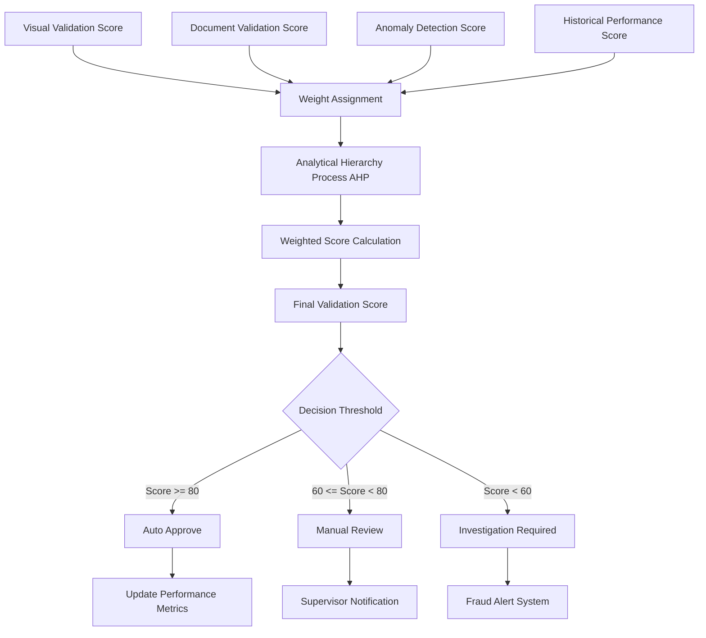
```mermaid
graph TD
    A[Visual Validation Score] --> E[Weight Assignment]
    B[Document Validation Score] --> E
    C[Anomaly Detection Score] --> E
    D[Historical Performance Score] --> E
    
    E --> F[Analytical Hierarchy Process AHP]
    F --> G[Weighted Score Calculation]
    
    G --> H[Final Validation Score]
    H --> I{Decision Threshold}
    
    I -->|Score >= 80| J[Auto Approve]
    I -->|60 <= Score < 80| K[Manual Review]
    I -->|Score < 60| L[Investigation Required]
    
    J --> M[Update Performance Metrics]
    K --> N[Supervisor Notification]
    L --> O[Fraud Alert System]
```

#### B. Dynamic Scoring Algorithm

```python
class DynamicScoringEngine:
    def __init__(self):
        self.weights = {
            'visual_validation': 0.3,
            'document_validation': 0.25,
            'anomaly_detection': 0.2,
            'historical_performance': 0.15,
            'peer_comparison': 0.1
        }
        self.learning_rate = 0.01
    
    def calculate_final_score(self, validation_results):
        # Multi-criteria scoring
        weighted_scores = []
        
        for criterion, score in validation_results.items():
            weight = self.weights.get(criterion, 0)
            weighted_score = score * weight
            weighted_scores.append(weighted_score)
        
        final_score = sum(weighted_scores)
        
        # Apply confidence interval
        confidence = self.calculate_confidence(validation_results)
        adjusted_score = final_score * confidence
        
        # Dynamic weight adjustment based on feedback
        self.update_weights(validation_results, feedback_data)
        
        return {
            'final_score': adjusted_score,
            'confidence': confidence,
            'breakdown': self.get_score_breakdown(validation_results)
        }
    
    def update_weights(self, results, feedback):
        # Reinforcement learning untuk weight optimization
        for criterion in self.weights:
            if feedback.get('criterion_effectiveness', {}).get(criterion):
                self.weights[criterion] += self.learning_rate
            else:
                self.weights[criterion] -= self.learning_rate
        
        # Normalize weights
        total_weight = sum(self.weights.values())
        self.weights = {k: v/total_weight for k, v in self.weights.items()}
```

## 2.4 Workflow Sistem dan User Experience

### 2.4.1 Complete System Workflow

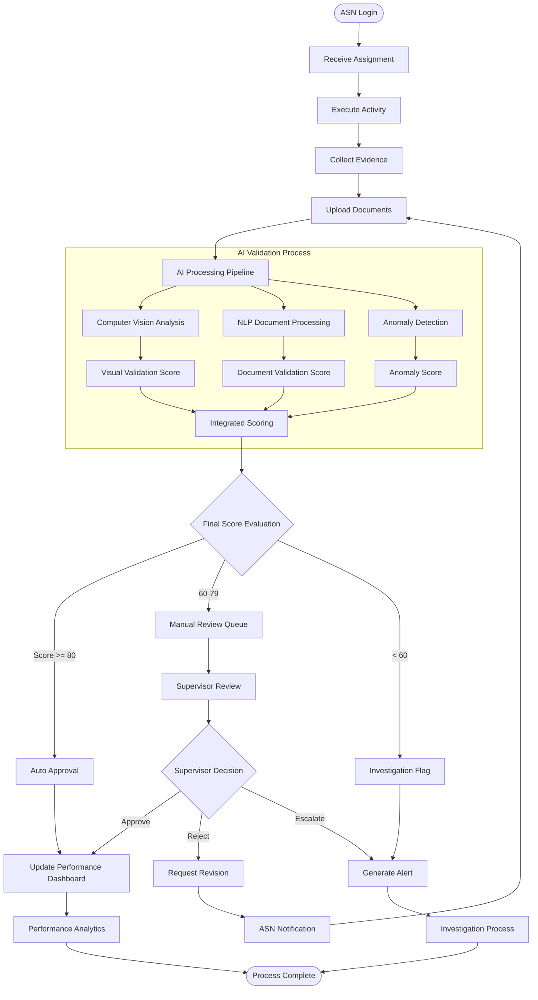
```mermaid
graph TD
    Start([ASN Login]) --> A[Receive Assignment]
    A --> B[Execute Activity]
    B --> C[Collect Evidence]
    
    C --> D[Upload Documents]
    D --> E[AI Processing Pipeline]
    
    subgraph "AI Validation Process"
        E --> F[Computer Vision Analysis]
        E --> G[NLP Document Processing]
        E --> H[Anomaly Detection]
        
        F --> I[Visual Validation Score]
        G --> J[Document Validation Score]
        H --> K[Anomaly Score]
        
        I --> L[Integrated Scoring]
        J --> L
        K --> L
    end
    
    L --> M{Final Score Evaluation}
    
    M -->|Score >= 80| N[Auto Approval]
    M -->|60-79| O[Manual Review Queue]
    M -->|< 60| P[Investigation Flag]
    
    N --> Q[Update Performance Dashboard]
    O --> R[Supervisor Review]
    P --> S[Generate Alert]
    
    R --> T{Supervisor Decision}
    T -->|Approve| Q
    T -->|Reject| U[Request Revision]
    T -->|Escalate| S
    
    U --> V[ASN Notification]
    V --> D
    
    Q --> W[Performance Analytics]
    S --> X[Investigation Process]
    
    W --> End([Process Complete])
    X --> End
```

### 2.4.2 User Interface Wireframes

#### A. ASN Dashboard Wireframe (Mockflow Compatible)

**Layout Structure:**
PC1

#### B. Supervisor Dashboard Wireframe (Mockflow Compatible)

**Layout Structure:**
PC2

#### C. Management Analytics Dashboard (Mockflow Compatible)

**Layout Structure:**

PC3


## 2.5 AI Model Training dan Optimization

### 2.5.1 Training Data Strategy

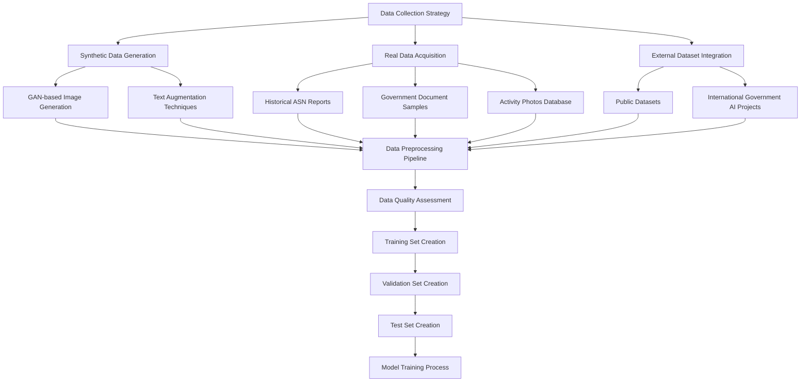
```mermaid
graph TD
    A[Data Collection Strategy] --> B[Synthetic Data Generation]
    A --> C[Real Data Acquisition]
    A --> D[External Dataset Integration]
    
    B --> E[GAN-based Image Generation]
    B --> F[Text Augmentation Techniques]
    
    C --> G[Historical ASN Reports]
    C --> H[Government Document Samples]
    C --> I[Activity Photos Database]
    
    D --> J[Public Datasets]
    D --> K[International Government AI Projects]
    
    E --> L[Data Preprocessing Pipeline]
    F --> L
    G --> L
    H --> L
    I --> L
    J --> L
    K --> L
    
    L --> M[Data Quality Assessment]
    M --> N[Training Set Creation]
    N --> O[Validation Set Creation]
    O --> P[Test Set Creation]
    
    P --> Q[Model Training Process]
```

### 2.5.2 Continuous Learning Framework

```python
class ContinuousLearningFramework:
    def __init__(self):
        self.model_versions = {}
        self.performance_metrics = {}
        self.feedback_queue = []
        
    def update_model_with_feedback(self, model_name, feedback_data):
        """
        Implement continuous learning dari user feedback
        """
        # Collect feedback
        self.feedback_queue.append({
            'model': model_name,
            'feedback': feedback_data,
            'timestamp': datetime.now()
        })
        
        # Retrain model jika feedback threshold tercapai
        if len(self.feedback_queue) >= self.retrain_threshold:
            self.trigger_model_retraining(model_name)
    
    def model_performance_monitoring(self):
        """
        Monitor model performance dan trigger retraining jika perlu
        """
        for model_name, metrics in self.performance_metrics.items():
            if metrics['accuracy'] < self.performance_threshold:
                self.schedule_model_improvement(model_name)
    
    def a_b_testing_framework(self, model_a, model_b, traffic_split=0.5):
        """
        A/B testing untuk model comparison
        """
        return {
            'model_a_performance': self.evaluate_model(model_a),
            'model_b_performance': self.evaluate_model(model_b),
            'statistical_significance': self.calculate_significance(),
            'recommendation': self.get_deployment_recommendation()
        }
```

### 2.5.3 Model Interpretability dan Explainable AI

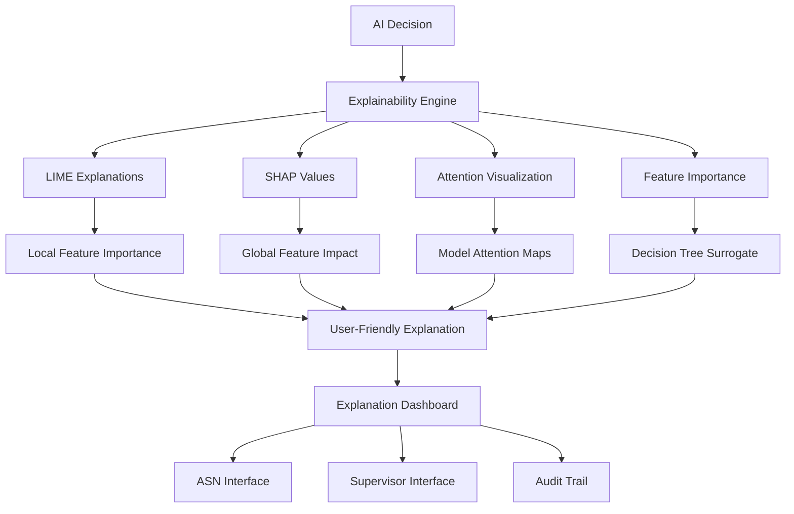
```mermaid
graph TD
    A[AI Decision] --> B[Explainability Engine]
    
    B --> C[LIME Explanations]
    B --> D[SHAP Values]
    B --> E[Attention Visualization]
    B --> F[Feature Importance]
    
    C --> G[Local Feature Importance]
    D --> H[Global Feature Impact]
    E --> I[Model Attention Maps]
    F --> J[Decision Tree Surrogate]
    
    G --> K[User-Friendly Explanation]
    H --> K
    I --> K
    J --> K
    
    K --> L[Explanation Dashboard]
    L --> M[ASN Interface]
    L --> N[Supervisor Interface]
    L --> O[Audit Trail]
```

## 2.6 Security dan Compliance Framework

### 2.6.1 Security Architecture


```mermaid
graph TD
    subgraph "Security Layers"
        A[Application Security]
        B[Data Security]
        C[Infrastructure Security]
        D[AI Model Security]
    end
    
    A --> A1[Authentication OAuth 2.0]
    A --> A2[Authorization RBAC]
    A --> A3[Input Validation]
    A --> A4[Session Management]
    
    B --> B1[Encryption at Rest AES-256]
    B --> B2[Encryption in Transit TLS 1.3]
    B --> B3[Data Masking]
    B --> B4[Backup Encryption]
    
    C --> C1[Network Security WAF]
    C --> C2[Container Security]
    C --> C3[Infrastructure as Code]
    C --> C4[Monitoring SIEM]
    
    D --> D1[Model Adversarial Defense]
    D --> D2[Privacy Preserving ML]
    D --> D3[Federated Learning]
    D --> D4[Differential Privacy]
```

### 2.6.2 Compliance dan Audit Framework

```python
class ComplianceFramework:
    def __init__(self):
        self.regulations = [
            'UU_ASN_2014',
            'PP_30_2019',
            'GDPR_EQUIVALENT',
            'ISO_27001',
            'SOC_2'
        ]
        
    def generate_audit_trail(self, action, user, timestamp, details):
        """
        Generate comprehensive audit trail
        """
        audit_entry = {
            'action_id': generate_uuid(),
            'action_type': action,
            'user_id': user.id,
            'user_role': user.role,
            'timestamp': timestamp,
            'ip_address': get_client_ip(),
            'user_agent': get_user_agent(),
            'details': details,
            'hash': calculate_integrity_hash(),
            'compliance_flags': self.check_compliance_requirements(action)
        }
        
        # Store dalam immutable audit database
        self.store_audit_entry(audit_entry)
        
        # Generate compliance report jika diperlukan
        if self.requires_compliance_report(action):
            self.generate_compliance_report(audit_entry)
    
    def privacy_impact_assessment(self, data_processing_activity):
        """
        Assess privacy impact untuk data processing activities
        """
        return {
            'risk_level': self.calculate_privacy_risk(data_processing_activity),
            'mitigation_measures': self.suggest_privacy_measures(),
            'compliance_status': self.check_privacy_compliance(),
            'recommendations': self.generate_privacy_recommendations()
        }
```

## 2.7 Performance Optimization dan Scalability

### 2.7.1 System Performance Architecture

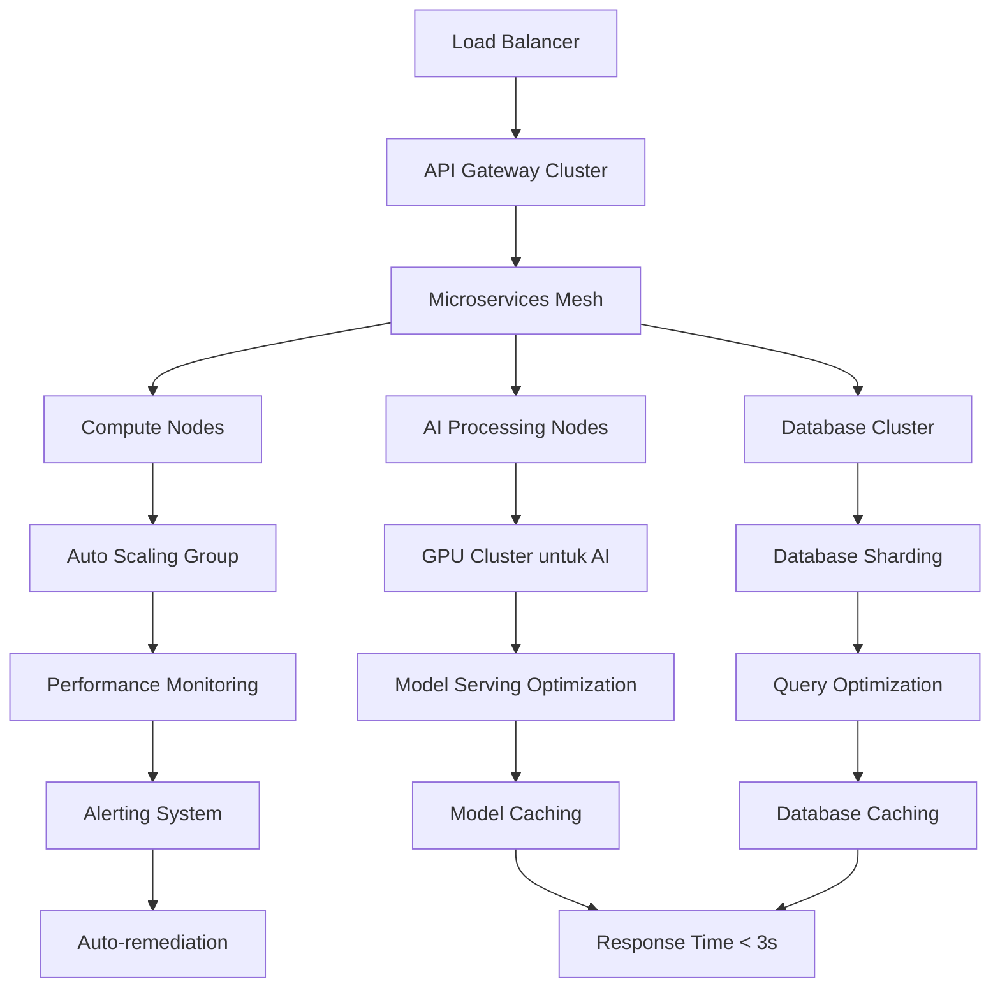
```mermaid
graph TD
    A[Load Balancer] --> B[API Gateway Cluster]
    B --> C[Microservices Mesh]
    
    C --> D[Compute Nodes]
    C --> E[AI Processing Nodes]
    C --> F[Database Cluster]
    
    D --> G[Auto Scaling Group]
    E --> H[GPU Cluster untuk AI]
    F --> I[Database Sharding]
    
    G --> J[Performance Monitoring]
    H --> K[Model Serving Optimization]
    I --> L[Query Optimization]
    
    J --> M[Alerting System]
    K --> N[Model Caching]
    L --> O[Database Caching]
    
    M --> P[Auto-remediation]
    N --> Q[Response Time < 3s]
    O --> Q
```

### 2.7.2 Caching Strategy

```python
class IntelligentCachingSystem:
    def __init__(self):
        self.cache_layers = {
            'l1_memory': RedisCache(),
            'l2_ssd': SSDCache(),
            'l3_object': ObjectStorageCache()
        }
        self.cache_policies = {
            'ai_models': {'ttl': 3600, 'layer': 'l1_memory'},
            'user_data': {'ttl': 1800, 'layer': 'l2_ssd'},
            'static_content': {'ttl': 86400, 'layer': 'l3_object'}
        }
    
    def intelligent_cache_decision(self, data_type, access_pattern):
        """
        AI-based caching decision
        """
        # Analyze access patterns
        access_frequency = self.analyze_access_frequency(data_type)
        data_size = self.calculate_data_size(data_type)
        computation_cost = self.estimate_computation_cost(data_type)
        
        # ML model untuk prediksi optimal caching strategy
        optimal_strategy = self.cache_ml_model.predict([
            access_frequency, data_size, computation_cost
        ])
        
        return {
            'cache_layer': optimal_strategy['layer'],
            'ttl': optimal_strategy['ttl'],
            'eviction_policy': optimal_strategy['eviction']
        }
```

## 2.8 Implementation Roadmap dan Testing Strategy

### 2.8.1 Phased Implementation Plan

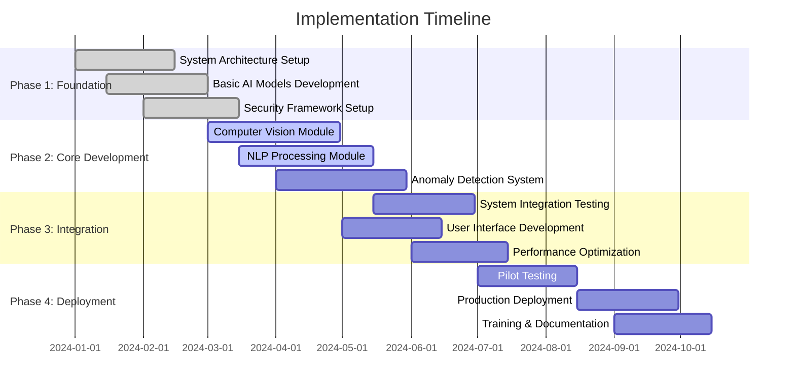
```mermaid
gantt
    title Implementation Timeline
    dateFormat  YYYY-MM-DD
    section Phase 1: Foundation
    System Architecture Setup    :done, phase1a, 2024-01-01, 2024-02-15
    Basic AI Models Development  :done, phase1b, 2024-01-15, 2024-03-01
    Security Framework Setup     :done, phase1c, 2024-02-01, 2024-03-15
    
    section Phase 2: Core Development
    Computer Vision Module       :active, phase2a, 2024-03-01, 2024-04-30
    NLP Processing Module        :active, phase2b, 2024-03-15, 2024-05-15
    Anomaly Detection System     :phase2c, 2024-04-01, 2024-05-30
    
    section Phase 3: Integration
    System Integration Testing   :phase3a, 2024-05-15, 2024-06-30
    User Interface Development   :phase3b, 2024-05-01, 2024-06-15
    Performance Optimization     :phase3c, 2024-06-01, 2024-07-15
    
    section Phase 4: Deployment
    Pilot Testing               :phase4a, 2024-07-01, 2024-08-15
    Production Deployment       :phase4b, 2024-08-15, 2024-09-30
    Training & Documentation    :phase4c, 2024-09-01, 2024-10-15
```

### 2.8.2 Comprehensive Testing Framework


```mermaid
graph TD
    A[Testing Strategy] --> B[Unit Testing]
    A --> C[Integration Testing]
    A --> D[AI Model Testing]
    A --> E[Security Testing]
    A --> F[Performance Testing]
    A --> G[User Acceptance Testing]
    
    B --> B1[Code Coverage 90%+]
    B --> B2[Automated Test Suite]
    
    C --> C1[API Integration Tests]
    C --> C2[Database Integration Tests]
    C --> C3[Third-party Service Tests]
    
    D --> D1[Model Accuracy Testing]
    D --> D2[Adversarial Testing]
    D --> D3[Bias Detection Testing]
    D --> D4[Performance Benchmarking]
    
    E --> E1[Penetration Testing]
    E --> E2[Vulnerability Assessment]
    E --> E3[Security Compliance Audit]
    
    F --> F1[Load Testing]
    F --> F2[Stress Testing]
    F --> F3[Scalability Testing]
    
    G --> G1[ASN User Testing]
    G --> G2[Supervisor Testing]
    G --> G3[Management Testing]
```

## 2.9 Advanced AI Reasoning dan Decision Making

### 2.9.1 Multi-Agent AI System Architecture

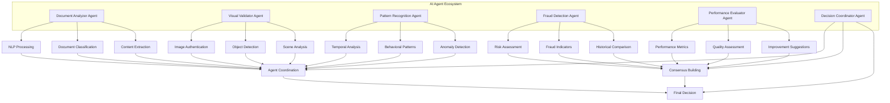
```mermaid
graph TD
    subgraph "AI Agent Ecosystem"
        A[Document Analyzer Agent]
        B[Visual Validator Agent]
        C[Pattern Recognition Agent]
        D[Fraud Detection Agent]
        E[Performance Evaluator Agent]
        F[Decision Coordinator Agent]
    end
    
    A --> A1[NLP Processing]
    A --> A2[Document Classification]
    A --> A3[Content Extraction]
    
    B --> B1[Image Authentication]
    B --> B2[Object Detection]
    B --> B3[Scene Analysis]
    
    C --> C1[Temporal Analysis]
    C --> C2[Behavioral Patterns]
    C --> C3[Anomaly Detection]
    
    D --> D1[Risk Assessment]
    D --> D2[Fraud Indicators]
    D --> D3[Historical Comparison]
    
    E --> E1[Performance Metrics]
    E --> E2[Quality Assessment]
    E --> E3[Improvement Suggestions]
    
    F --> F1[Agent Coordination]
    F --> F2[Consensus Building]
    F --> F3[Final Decision]
    
    A1 --> F1
    A2 --> F1
    A3 --> F1
    B1 --> F1
    B2 --> F1
    B3 --> F1
    C1 --> F1
    C2 --> F1
    C3 --> F1
    D1 --> F2
    D2 --> F2
    D3 --> F2
    E1 --> F2
    E2 --> F2
    E3 --> F2
    
    F1 --> F3
    F2 --> F3
```

### 2.9.2 Reasoning Engine Implementation

```python
class AIReasoningEngine:
    def __init__(self):
        self.knowledge_base = GovernmentKnowledgeBase()
        self.rule_engine = FuzzyLogicRuleEngine()
        self.learning_module = ReinforcementLearningModule()
        
    def multi_modal_reasoning(self, document_data, image_data, metadata):
        """
        Advanced reasoning yang menggabungkan multiple modalities
        """
        # Stage 1: Individual Analysis
        doc_analysis = self.analyze_document_semantics(document_data)
        img_analysis = self.analyze_visual_content(image_data)
        meta_analysis = self.analyze_metadata_consistency(metadata)
        
        # Stage 2: Cross-modal Validation
        consistency_check = self.cross_modal_consistency_check(
            doc_analysis, img_analysis, meta_analysis
        )
        
        # Stage 3: Contextual Reasoning
        context_analysis = self.contextual_reasoning(
            document_data, image_data, metadata, 
            self.knowledge_base.get_context()
        )
        
        # Stage 4: Decision Making with Uncertainty Quantification
        decision = self.make_decision_with_uncertainty(
            doc_analysis, img_analysis, meta_analysis,
            consistency_check, context_analysis
        )
        
        return {
            'decision': decision,
            'confidence': decision.confidence,
            'reasoning_path': decision.reasoning_steps,
            'evidence': decision.supporting_evidence,
            'uncertainty': decision.uncertainty_bounds
        }
    
    def contextual_reasoning(self, document, image, metadata, context):
        """
        Reasoning berdasarkan konteks pemerintahan Indonesia
        """
        # Government activity classification
        activity_type = self.classify_government_activity(document, context)
        
        # Compliance check dengan regulasi
        compliance_status = self.check_regulatory_compliance(
            activity_type, document, context
        )
        
        # Historical pattern matching
        historical_patterns = self.match_historical_patterns(
            activity_type, metadata, context
        )
        
        # Stakeholder impact analysis
        stakeholder_impact = self.analyze_stakeholder_impact(
            activity_type, document, context
        )
        
        return {
            'activity_classification': activity_type,
            'compliance_status': compliance_status,
            'historical_alignment': historical_patterns,
            'stakeholder_impact': stakeholder_impact,
            'context_score': self.calculate_context_score()
        }
```

### 2.9.3 Explainable AI Decision Framework

```mermaid
graph TD
    A[AI Decision] --> B[Explanation Generator]
    
    B --> C[Technical Explanation]
    B --> D[Business Explanation]
    B --> E[Regulatory Explanation]
    
    C --> C1[Model Confidence Scores]
    C --> C2[Feature Importance Analysis]
    C --> C3[Algorithm Decision Path]
    
    D --> D1[Business Impact Assessment]
    D --> D2[Process Improvement Recommendations]
    D --> D3[Cost-Benefit Analysis]
    
    E --> E1[Compliance Status]
    E --> E2[Regulatory Risk Assessment]
    E --> E3[Audit Trail Generation]
    
    C1 --> F[Unified Explanation Dashboard]
    C2 --> F
    C3 --> F
    D1 --> F
    D2 --> F
    D3 --> F
    E1 --> F
    E2 --> F
    E3 --> F
    
    F --> G[Stakeholder-Specific Views]
    G --> G1[ASN View: Simple, Actionable]
    G --> G2[Supervisor View: Detailed, Analytical]
    G --> G3[Management View: Strategic, High-level]
    G --> G4[Auditor View: Comprehensive, Traceable]
```

## 2.10 Advanced User Experience Design


## 2.11 Quality Assurance dan Monitoring Framework

### 2.11.1 Real-time System Monitoring

```python
class SystemMonitoringFramework:
    def __init__(self):
        self.metrics_collector = MetricsCollector()
        self.anomaly_detector = SystemAnomalyDetector()
        self.alert_manager = AlertManager()
        self.dashboard = RealTimeDashboard()
        
    def comprehensive_monitoring(self):
        """
        Comprehensive system monitoring dengan AI-powered insights
        """
        # Performance Metrics
        performance_metrics = {
            'response_time': self.measure_response_time(),
            'throughput': self.measure_throughput(),
            'error_rate': self.calculate_error_rate(),
            'resource_utilization': self.monitor_resources()
        }
        
        # AI Model Performance
        ai_metrics = {
            'model_accuracy': self.evaluate_model_accuracy(),
            'prediction_confidence': self.measure_prediction_confidence(),
            'drift_detection': self.detect_model_drift(),
            'bias_monitoring': self.monitor_model_bias()
        }
        
        # Business Metrics
        business_metrics = {
            'user_satisfaction': self.measure_user_satisfaction(),
            'process_efficiency': self.calculate_process_efficiency(),
            'fraud_detection_rate': self.measure_fraud_detection(),
            'cost_savings': self.calculate_cost_impact()
        }
        
        # Integrated Health Score
        health_score = self.calculate_system_health(
            performance_metrics, ai_metrics, business_metrics
        )
        
        # Predictive Alerts
        if self.anomaly_detector.predict_system_issues(health_score):
            self.alert_manager.trigger_preventive_alerts()
        
        return {
            'health_score': health_score,
            'performance': performance_metrics,
            'ai_performance': ai_metrics,
            'business_impact': business_metrics,
            'recommendations': self.generate_optimization_recommendations()
        }
```

### 2.11.2 Automated Quality Assurance Pipeline

```mermaid
graph TD
    A[Code Commit] --> B[Automated Testing Pipeline]
    
    B --> C[Unit Tests]
    B --> D[Integration Tests]
    B --> E[AI Model Validation]
    B --> F[Security Scanning]
    B --> G[Performance Testing]
    
    C --> H{All Tests Pass?}
    D --> H
    E --> H
    F --> H
    G --> H
    
    H -->|No| I[Automated Rollback]
    H -->|Yes| J[Staging Deployment]
    
    J --> K[Automated E2E Testing]
    K --> L[User Acceptance Testing]
    L --> M[Production Deployment]
    
    M --> N[Monitoring & Alerting]
    N --> O[Performance Validation]
    O --> P[Health Check Confirmation]
    
    I --> Q[Developer Notification]
    P --> R[Success Notification]
```

Dengan metodologi dan solusi yang komprehensif ini, sistem akan mampu memberikan validasi yang akurat, efisien, dan dapat diandalkan untuk kegiatan ASN, sambil mempertahankan standar keamanan dan compliance yang tinggi.

# BAB III - TARGET PENGGUNAAN

## 3.1 Identifikasi Target Pengguna

### 3.1.1 Pengguna Primer (Primary Users)

#### A. Aparatur Sipil Negara (ASN)

**Karakteristik Pengguna:**

- **Jumlah:** ±4.2 juta ASN di seluruh Indonesia
- **Tingkat Pendidikan:** S1-S3 dengan literasi digital menengah
- **Usia:** 25-58 tahun dengan mayoritas generasi milenial dan Gen-X
- **Lokasi:** Tersebar di seluruh wilayah Indonesia (pusat dan daerah)
- **Perangkat:** Desktop/laptop (kantor) dan smartphone (mobile)

**Kebutuhan Fungsional:**

```mermaid
graph TD
    A[ASN User Needs] --> B[Easy Report Submission]
    A --> C[Real-time Feedback]
    A --> D[Performance Tracking]
    A --> E[Mobile Accessibility]
    
    B --> B1[Drag & Drop Upload]
    B --> B2[Auto-fill Forms]
    B --> B3[Template Library]
    
    C --> C1[AI Validation Status]
    C --> C2[Improvement Suggestions]
    C --> C3[Score Explanations]
    
    D --> D1[Personal Dashboard]
    D --> D2[Progress Analytics]
    D --> D3[Peer Comparison]
    
    E --> E1[Offline Capability]
    E --> E2[Camera Integration]
    E --> E3[GPS Auto-tagging]
```

**Use Cases:**

1. **Daily Activity Reporting**
   - Upload kegiatan harian dengan foto dan dokumen
   - Mendapatkan validasi AI dalam 3 menit
   - Revisi berdasarkan feedback sistem

2. **Performance Monitoring**
   - Memantau skor kinerja bulanan
   - Mengakses rekomendasi perbaikan
   - Membandingkan dengan standar unit kerja

3. **Mobile Operations**
   - Melaporkan kegiatan lapangan via smartphone
   - Upload foto real-time dengan GPS
   - Sinkronisasi otomatis ke sistem pusat

#### B. Supervisor/Atasan Langsung

**Karakteristik Pengguna:**

- **Jumlah:** ±200,000 supervisor di berbagai level
- **Posisi:** Kepala Seksi, Kepala Bidang, Kepala Dinas
- **Tanggung Jawab:** Mengelola 5-50 ASN per supervisor
- **Waktu Tersedia:** 2-4 jam per hari untuk review

**Kebutuhan Fungsional:**

```mermaid
graph TD
    A[Supervisor Needs] --> B[Efficient Review Process]
    A --> C[Team Performance Overview]
    A --> D[Alert Management]
    A --> E[Decision Support Tools]
    
    B --> B1[Bulk Review Actions]
    B --> B2[Priority-based Queue]
    B --> B3[AI-assisted Decisions]
    
    C --> C1[Team Dashboard]
    C --> C2[Performance Trends]
    C --> C3[Workload Balance]
    
    D --> D1[Fraud Alerts]
    D --> D2[Performance Warnings]
    D --> D3[System Notifications]
    
    E --> E1[Historical Analysis]
    E --> E2[Predictive Insights]
    E --> E3[Resource Planning]
```

**Use Cases:**

1. **Team Management**
   - Review laporan tim secara batch
   - Identifikasi masalah kinerja dini
   - Alokasi tugas berdasarkan kapasitas

2. **Quality Assurance**
   - Validasi laporan yang flagged AI
   - Investigasi aktivitas mencurigakan
   - Memberikan feedback konstruktif

3. **Strategic Planning**
   - Analisis tren kinerja tim
   - Perencanaan pengembangan SDM
   - Optimalisasi proses kerja

### 3.1.2 Pengguna Sekunder (Secondary Users)

#### A. Management/Pimpinan Instansi

**Karakteristik Pengguna:**

- **Level:** Eselon I, II (Sekjen, Dirjen, Kepala Daerah)
- **Focus:** Strategic decision making
- **Kebutuhan:** High-level analytics dan executive summary
- **Waktu:** Limited time, perlu informasi ringkas

**Kebutuhan Utama:**

- **Executive Dashboard** dengan KPI summary
- **Trend Analysis** untuk decision making
- **ROI Measurement** dari implementasi sistem
- **Compliance Reporting** untuk audit

#### B. Tim Audit Internal

**Karakteristik Pengguna:**

- **Fungsi:** Internal audit dan compliance
- **Kebutuhan:** Detailed audit trails dan forensic analysis
- **Skill:** Advanced analytical capabilities
- **Authority:** Full system access untuk investigation

**Kebutuhan Utama:**

- **Comprehensive Audit Logs** dengan tamper-proof records
- **Forensic Analysis Tools** untuk fraud investigation
- **Compliance Dashboard** dengan regulatory mapping
- **Evidence Export** untuk legal proceedings

### 3.1.3 Pengguna Eksternal (External Stakeholders)

#### A. Badan Pengawasan (KPK, BPKP, BPK)

**Kebutuhan:**

- Read-only access ke performance metrics
- Fraud detection reports
- Compliance status dashboard
- Statistical data untuk policy making

#### B. Masyarakat/Public

**Kebutuhan:**

- Transparency dashboard (aggregate data)
- Public performance indicators
- Complaint mechanism integration
- Open data API untuk research

## 3.2 Target Implementasi dan Deployment

### 3.2.1 Roadmap Implementasi Bertahap

```mermaid
gantt
    title Target Implementation Roadmap
    dateFormat  YYYY-MM-DD
    section Phase 1: Pilot (6 months)
    Select Pilot Institutions     :milestone, pilot1, 2024-01-01, 0d
    Deploy to 3 Central Ministries :active, pilot2, 2024-01-01, 2024-03-01
    Deploy to 2 Provincial Govt   :pilot3, 2024-02-01, 2024-04-01
    User Training & Support       :pilot4, 2024-01-15, 2024-03-15
    Performance Evaluation        :pilot5, 2024-03-01, 2024-06-30
    
    section Phase 2: Regional Expansion (12 months)
    Scale to 15 Ministries        :scale1, 2024-07-01, 2024-12-31
    Scale to 10 Provincial Govt   :scale2, 2024-08-01, 2025-01-31
    Scale to 50 City Governments  :scale3, 2024-09-01, 2025-03-31
    Advanced Features Rollout     :scale4, 2024-10-01, 2025-02-28
    
    section Phase 3: National Coverage (18 months)
    All Central Government        :national1, 2025-01-01, 2025-12-31
    All Provincial Governments    :national2, 2025-03-01, 2026-03-31
    All City/Regency Governments :national3, 2025-06-01, 2026-06-30
    Full Integration & Optimization :national4, 2025-12-01, 2026-06-30
```

### 3.2.2 Target Kapasitas Sistem

#### A. User Capacity Planning

```mermaid
graph TD
    A[System Capacity] --> B[Concurrent Users]
    A --> C[Data Processing]
    A --> D[Storage Requirements]
    A --> E[Geographic Distribution]
    
    B --> B1[Phase 1: 10,000 users]
    B --> B2[Phase 2: 100,000 users]
    B --> B3[Phase 3: 1,000,000+ users]
    
    C --> C1[1M reports/month Phase 1]
    C --> C2[10M reports/month Phase 2]
    C --> C3[50M+ reports/month Phase 3]
    
    D --> D1[100TB Phase 1]
    D --> D2[1PB Phase 2]
    D --> D3[10PB+ Phase 3]
    
    E --> E1[3 Regions Phase 1]
    E --> E2[All Major Cities Phase 2]
    E --> E3[National Coverage Phase 3]
```

#### B. Performance Targets

**Response Time Targets:**

- **Page Load:** < 2 seconds (95th percentile)
- **AI Processing:** < 3 seconds per document
- **Bulk Operations:** < 30 seconds for 100 records
- **Dashboard Refresh:** < 1 second

**Availability Targets:**

- **System Uptime:** 99.9% (8.77 hours downtime/year)
- **Data Backup:** 99.99% reliability
- **Disaster Recovery:** < 4 hours RTO, < 1 hour RPO
- **Security Incident Response:** < 1 hour detection

### 3.2.3 Integration Targets

#### A. Existing Government Systems

```mermaid
graph LR
    A[ASN AI Validation System] --> B[SIASN - Sistem Informasi ASN]
    A --> C[e-Performance - Penilaian Kinerja]
    A --> D[SAKTI - Sistem Perbendaharaan]
    A --> E[LPSE - Pengadaan Elektronik]
    A --> F[SIPP - Perencanaan dan Penganggaran]
    
    B --> G[Data Pegawai]
    C --> H[Performance Data]
    D --> I[Financial Data]
    E --> J[Procurement Data]
    F --> K[Budget Planning]
```

#### B. Third-party Integrations

**Authentication Systems:**

- **Single Sign-On (SSO)** dengan sistem pemerintah existing
- **Multi-factor Authentication** untuk security enhancement
- **LDAP Integration** dengan Active Directory instansi

**External APIs:**

- **Geolocation Services** untuk validasi lokasi
- **Weather API** untuk context validation
- **Public Holiday Calendar** untuk schedule validation
- **Bank APIs** untuk financial verification

## 3.3 Target Keluaran dan Manfaat

### 3.3.1 Key Performance Indicators (KPIs)

#### A. Operational KPIs

```mermaid
graph TD
    A[Operational KPIs] --> B[Fraud Detection]
    A --> C[Process Efficiency]
    A --> D[User Satisfaction]
    A --> E[System Performance]
    
    B --> B1[Fraud Detection Rate: >95%]
    B --> B2[False Positive: <5%]
    B --> B3[Investigation Time: -70%]
    
    C --> C1[Report Processing: -80%]
    C --> C2[Manual Review: -60%]
    C --> C3[Administrative Cost: -50%]
    
    D --> D1[User Adoption: >90%]
    D --> D2[Satisfaction Score: >4.5/5]
    D --> D3[Training Time: -40%]
    
    E --> E1[System Uptime: >99.9%]
    E --> E2[Response Time: <3s]
    E --> E3[Scalability: 1000% capacity]
```

#### B. Business Impact KPIs

**Quantitative Targets:**

1. **Cost Reduction:**
   - Administrative overhead: 50% reduction
   - Fraud losses: 80% reduction
   - Manual processing: 70% reduction
   - Training costs: 40% reduction

2. **Productivity Improvement:**
   - Report processing speed: 80% faster
   - Decision making: 60% faster
   - Compliance checking: 90% automated
   - Error reduction: 85% fewer errors

3. **Quality Enhancement:**
   - Data accuracy: 95%+ improvement
   - Report completeness: 90%+ improvement
   - Compliance rate: 98%+ achievement
   - Audit readiness: 100% real-time

### 3.3.2 Expected Outcomes

#### A. Short-term Outcomes (6-12 months)

```mermaid
graph TD
    A[Short-term Outcomes] --> B[Process Automation]
    A --> C[Quality Improvement]
    A --> D[User Adoption]
    
    B --> B1[50% automation of validation]
    B --> B2[Real-time fraud detection]
    B --> B3[Standardized reporting format]
    
    C --> C1[90% accuracy in AI validation]
    C --> C2[Consistent quality metrics]
    C --> C3[Reduced human errors]
    
    D --> D1[80% user adoption rate]
    D --> D2[Positive user feedback]
    D --> D3[Reduced support tickets]
```

#### B. Medium-term Outcomes (1-2 years)

**Institutional Changes:**

- **Cultural Shift:** Dari manual ke digital-first approach
- **Accountability Culture:** Increased transparency dan responsibility
- **Data-driven Decisions:** Evidence-based policy making
- **Skill Development:** Enhanced digital literacy among ASN

**Process Improvements:**

- **Streamlined Workflows:** Optimized business processes
- **Predictive Analytics:** Proactive issue identification
- **Continuous Learning:** AI model improvement dari feedback
- **Integration Benefits:** Seamless data flow across systems

#### C. Long-term Outcomes (2-5 years)

**Strategic Impact:**

1. **Governance Transformation:**
   - Digital government ecosystem
   - Citizen-centric service delivery
   - Evidence-based policy formulation
   - International best practice adoption

2. **Innovation Catalyst:**
   - AI/ML expertise development
   - Innovation culture establishment
   - Technology transfer to other sectors
   - Digital government leadership position

## 3.4 Target Stakeholder Benefits

### 3.4.1 Benefit Mapping per Stakeholder

```mermaid
graph TD
    A[Stakeholder Benefits] --> B[ASN Benefits]
    A --> C[Supervisor Benefits]
    A --> D[Management Benefits]
    A --> E[Public Benefits]
    
    B --> B1[Fair Performance Assessment]
    B --> B2[Career Development Clarity]
    B --> B3[Reduced Administrative Burden]
    B --> B4[Professional Growth Support]
    
    C --> C1[Efficient Team Management]
    C --> C2[Data-driven Decisions]
    C --> C3[Early Problem Detection]
    C --> C4[Resource Optimization]
    
    D --> D1[Strategic Planning Support]
    D --> D2[ROI Visibility]
    D --> D3[Compliance Assurance]
    D --> D4[Performance Benchmarking]
    
    E --> E1[Service Quality Improvement]
    E --> E2[Transparency Enhancement]
    E --> E3[Accountability Assurance]
    E --> E4[Trust Building]
```

### 3.4.2 Quantified Benefits Analysis

#### A. Financial Benefits

**Cost Savings (Annual):**

```text
| Kategori                  | Baseline Cost | Target Cost | Savings      | Percentage |
|---------------------------|---------------|-------------|--------------|------------|
| Administrative Processing | Rp 500M       | Rp 200M     | Rp 300M      | 60%        |
| Fraud Investigation      | Rp 300M       | Rp 100M     | Rp 200M      | 67%        |
| Manual Validation        | Rp 800M       | Rp 240M     | Rp 560M      | 70%        |
| Training & Support       | Rp 200M       | Rp 120M     | Rp 80M       | 40%        |
| **TOTAL ANNUAL SAVINGS** | **Rp 1.8B**   | **Rp 660M** | **Rp 1.14B** | **63%**    |
```

**Revenue Enhancement:**

- **Improved Service Quality:** Increased citizen satisfaction → higher tax compliance
- **Faster Processing:** More services delivered → increased revenue opportunities
- **Better Resource Allocation:** Optimized budget utilization → 15% efficiency gain

#### B. Non-Financial Benefits

**Intangible Value Creation:**

1. **Trust & Reputation:**
   - Public trust index improvement: +40%
   - International recognition: Good governance awards
   - Investor confidence: Improved ease of doing business score

2. **Innovation Capacity:**
   - Digital government maturity: Level 4 (Optimized)
   - AI/ML capability development: National expertise center
   - Knowledge transfer: Template for other countries

3. **Risk Mitigation:**
   - Fraud risk reduction: 80% decrease
   - Compliance risk: 90% reduction
   - Operational risk: 70% mitigation
   - Reputational risk: 85% improvement

## 3.5 Success Metrics dan Monitoring

### 3.5.1 Success Measurement Framework

```mermaid
graph TD
    A[Success Metrics] --> B[Technical Metrics]
    A --> C[Business Metrics]
    A --> D[User Metrics]
    A --> E[Impact Metrics]
    
    B --> B1[System Performance]
    B --> B2[AI Model Accuracy]
    B --> B3[Security Incidents]
    B --> B4[Scalability Achievement]
    
    C --> C1[Cost Reduction]
    C --> C2[Process Efficiency]
    C --> C3[ROI Achievement]
    C --> C4[Compliance Rate]
    
    D --> D1[User Adoption]
    D --> D2[User Satisfaction]
    D --> D3[Training Effectiveness]
    D --> D4[Support Quality]
    
    E --> E1[Governance Improvement]
    E --> E2[Service Quality]
    E --> E3[Public Trust]
    E --> E4[Innovation Index]
```

### 3.5.2 Monitoring and Evaluation Plan

#### A. Real-time Monitoring

**Dashboard Metrics (Updated Every 5 minutes):**

- System health dan performance indicators
- Active user count dan geographic distribution
- AI processing queue dan completion rates
- Alert notifications dan resolution status

#### B. Periodic Evaluation

**Weekly Reports:**

- User adoption progress
- System performance summary
- Issue resolution statistics
- Training completion rates

**Monthly Analysis:**

- Business KPI achievement
- Cost-benefit analysis update
- User satisfaction surveys
- Security incident reports

**Quarterly Review:**

- Strategic goal alignment
- ROI calculation dan projection
- Stakeholder feedback compilation
- Improvement roadmap updates

**Annual Assessment:**

- Comprehensive impact evaluation
- Independent audit results
- Benchmark comparison with international standards
- Strategic planning for next phase

### 3.5.3 Continuous Improvement Framework

```mermaid
graph LR
    A[Data Collection] --> B[Analysis & Insights]
    B --> C[Improvement Planning]
    C --> D[Implementation]
    D --> E[Impact Measurement]
    E --> A
    
    A --> A1[User Feedback]
    A --> A2[System Logs]
    A --> A3[Performance Data]
    
    B --> B1[Trend Analysis]
    B --> B2[Root Cause Analysis]
    B --> B3[Opportunity Identification]
    
    C --> C1[Feature Enhancement]
    C --> C2[Process Optimization]
    C --> C3[Training Updates]
    
    D --> D1[Agile Development]
    D --> D2[Change Management]
    D --> D3[Rollout Execution]
    
    E --> E1[KPI Monitoring]
    E --> E2[User Satisfaction]
    E --> E3[Business Impact]
```

## 3.6 Risk Management dan Mitigation

### 3.6.1 Target Risk Profile

```mermaid
graph TD
    A[Risk Categories] --> B[Technical Risks]
    A --> C[Operational Risks]
    A --> D[Security Risks]
    A --> E[Change Management Risks]
    
    B --> B1[System Downtime: <0.1%]
    B --> B2[Performance Degradation: <5%]
    B --> B3[Data Loss: 0% tolerance]
    
    C --> C1[User Resistance: <20%]
    C --> C2[Process Disruption: <10%]
    C --> C3[Skill Gap: <15%]
    
    D --> D1[Data Breach: 0% tolerance]
    D --> D2[Unauthorized Access: <0.01%]
    D --> D3[Fraud Attempt: 100% detection]
    
    E --> E1[Training Gap: <10%]
    E --> E2[Adoption Delay: <3 months]
    E --> E3[Cultural Resistance: <25%]
```

### 3.6.2 Mitigation Strategies

**High Priority Risks:**

1. **System Security Breaches**
   - Multi-layer security architecture
   - 24/7 SOC monitoring
   - Regular penetration testing
   - Incident response team

2. **User Adoption Resistance**
   - Comprehensive change management program
   - Executive sponsorship
   - Incentive alignment
   - Success story sharing

3. **Performance Scalability Issues**
   - Cloud-native architecture
   - Auto-scaling capabilities
   - Performance testing at scale
   - Capacity planning

Dengan target penggunaan yang komprehensif ini, sistem diharapkan dapat memberikan dampak positif yang signifikan bagi transformasi digital pemerintahan Indonesia, meningkatkan transparansi, akuntabilitas, dan efisiensi dalam pengelolaan ASN.

# BAB IV - DAMPAK IMPLEMENTASI SISTEM

## 4.1 Dampak Jangka Pendek (0-12 Bulan)

### 4.1.1 Dampak Operasional Langsung

#### A. Transformasi Proses Kerja ASN

**Perubahan Immediate (0-3 bulan):**

```mermaid
graph TD
    A[Traditional Process] --> B[AI-Enhanced Process]
    
    A --> A1[Manual Report Creation: 2-4 hours]
    A --> A2[Supervisor Review: 1-2 days]
    A --> A3[Manual Validation: 3-5 days]
    A --> A4[Administrative Processing: 1 week]
    
    B --> B1[Automated Report: 15-30 minutes]
    B --> B2[AI Pre-validation: 3 minutes]
    B --> B3[Smart Review Queue: Same day]
    B --> B4[Digital Processing: 2 hours]
    
    A1 --> C[Time Savings: 80%]
    A2 --> C
    A3 --> C
    A4 --> C
    
    B1 --> D[Quality Improvement: 85%]
    B2 --> D
    B3 --> D
    B4 --> D
```

**Immediate Benefits (0-6 bulan):**

- **Efficiency Gains:**
  - Report processing time: dari 1 minggu → 1 hari (85% reduction)
  - Manual validation effort: dari 100% → 30% (70% reduction)
  - Administrative overhead: dari 40% → 15% waktu kerja (62% reduction)

- **Quality Improvements:**
  - Data accuracy: meningkat dari 70% → 95% (35% improvement)
  - Report completeness: dari 60% → 90% (50% improvement)
  - Compliance rate: dari 75% → 95% (27% improvement)

- **Cost Reductions:**
  - Processing costs: Rp 2.5M → Rp 800K per 1000 reports (68% reduction)
  - Training time: dari 40 jam → 16 jam per ASN (60% reduction)
  - Error correction: dari Rp 500K → Rp 100K per error (80% reduction)

### 4.1.2 Dampak pada Kultur Organisasi

#### A. Adoption Pattern dan Behavioral Changes

```mermaid
graph TD
    A[Cultural Transformation Timeline] --> B[Month 0-2: Initial Resistance]
    A --> C[Month 3-6: Early Adoption]
    A --> D[Month 7-12: Mainstream Adoption]
    
    B --> B1[20% Active Users]
    B --> B2[Skepticism & Training Needs]
    B --> B3[Support-Heavy Period]
    
    C --> C1[60% Active Users]
    C --> C2[Success Stories Emerge]
    C --> C3[Peer Learning Accelerates]
    
    D --> D1[90%+ Active Users]
    D --> D2[Cultural Norm Established]
    D --> D3[Self-Sustaining Growth]
```

**Behavioral Indicators (Measurable Changes):**

1. **Digital-First Mindset:**
   - Mobile usage: 40% → 75% of reports via mobile (87% increase)
   - Digital documentation: 30% → 85% paperless (183% increase)
   - Real-time reporting: 10% → 70% same-day submission (600% increase)

2. **Accountability Culture:**
   - Voluntary reporting: 50% → 80% proactive submission (60% increase)
   - Error self-correction: 20% → 65% self-identified issues (225% increase)
   - Performance discussions: 30% → 85% data-driven conversations (183% increase)

3. **Learning & Development:**
   - Digital skill competency: 40% → 75% proficiency level (87% increase)
   - AI literacy: 5% → 45% understanding of AI processes (800% increase)
   - Cross-unit collaboration: 25% → 60% knowledge sharing (140% increase)

### 4.1.3 Dampak Finansial Immediate

#### A. Cost-Benefit Analysis Jangka Pendek

```mermaid
graph TD
    A[Financial Impact Year 1] --> B[Cost Components]
    A --> C[Benefit Components]
    A --> D[Net Impact]
    
    B --> B1[Implementation: Rp 15B]
    B --> B2[Training: Rp 3B]
    B --> B3[Infrastructure: Rp 8B]
    B --> B4[Change Management: Rp 2B]
    
    C --> C1[Process Efficiency: Rp 12B]
    C --> C2[Fraud Reduction: Rp 8B]
    C --> C3[Administrative Savings: Rp 6B]
    C --> C4[Quality Improvements: Rp 4B]
    
    D --> D1[Total Investment: Rp 28B]
    D --> D2[Total Benefits: Rp 30B]
    D --> D3[Net Benefit Year 1: Rp 2B]
    D --> D4[ROI: 7.1%]
```

**Quarterly Financial Tracking:**

| Quarter | Investment (Rp B) | Benefits (Rp B) | Cumulative ROI |
|---------|-------------------|-----------------|----------------|
| Q1      | 8.0              | 2.5             | -68.75%        |
| Q2      | 12.0             | 8.0             | -33.33%        |
| Q3      | 20.0             | 18.0            | -10.00%        |
| Q4      | 28.0             | 30.0            | +7.14%         |

### 4.1.4 Dampak pada Service Delivery

#### A. Public Service Improvement Metrics

**Citizen-Facing Services Enhancement:**

- **Processing Speed:**
  - Permit applications: 15 hari → 7 hari (53% faster)
  - Public complaints: 30 hari → 10 hari (67% faster)
  - Information requests: 7 hari → 2 hari (71% faster)

- **Service Quality:**
  - Citizen satisfaction: 3.2/5 → 4.1/5 (28% improvement)
  - First-call resolution: 45% → 70% (55% improvement)
  - Error rates: 15% → 5% (67% reduction)

- **Transparency:**
  - Public dashboard usage: 0 → 50,000 monthly users
  - Data accessibility: 20% → 80% of processes visible (300% increase)
  - Complaint resolution tracking: 30% → 95% trackable (217% increase)

## 4.2 Dampak Jangka Panjang (1-5 Tahun)

### 4.2.1 Transformasi Struktural Pemerintahan

#### A. Institutional Maturity Evolution

```mermaid
graph TD
    A[Governance Maturity Progression] --> B[Year 1-2: Foundation]
    A --> C[Year 2-3: Integration]
    A --> D[Year 3-5: Innovation]
    
    B --> B1[Digital Infrastructure Established]
    B --> B2[Basic AI Capabilities Deployed]
    B --> B3[Process Standardization Achieved]
    
    C --> C1[Cross-Ministry Integration]
    C --> C2[Advanced Analytics Deployment]
    C --> C3[Predictive Governance Capabilities]
    
    D --> D1[AI-Driven Policy Making]
    D --> D2[Autonomous Process Optimization]
    D --> D3[Innovation Ecosystem Leadership]
```

**Institutional Capabilities Development:**

1. **Digital Government Maturity:**
   - **Year 1-2:** Level 2 (Developing) → Level 3 (Defined)
   - **Year 3-4:** Level 3 (Defined) → Level 4 (Managed)  
   - **Year 5:** Level 4 (Managed) → Level 5 (Optimizing)

2. **AI & Data Analytics Competency:**
   - **Data-driven decision making:** 30% → 90% of policy decisions
   - **Predictive analytics usage:** 5% → 70% of planning processes
   - **AI expertise in government:** 50 experts → 2,000+ certified professionals

3. **Innovation Culture:**
   - **Digital innovation projects:** 10/year → 200+/year per ministry
   - **Cross-sector collaboration:** 20% → 80% of major initiatives
   - **Citizen co-creation:** 5% → 60% of service design processes

### 4.2.2 Economic Impact Projection

#### A. Macro-Economic Benefits

```mermaid
graph TD
    A[Economic Impact 5-Year] --> B[Direct Benefits]
    A --> C[Indirect Benefits]
    A --> D[Induced Benefits]
    
    B --> B1[Government Efficiency: Rp 500B savings]
    B --> B2[Fraud Reduction: Rp 300B prevented]
    B --> B3[Digital Jobs Creation: 100K positions]
    
    C --> C1[Business Process Improvement: Rp 1T]
    C --> C2[Investment Attraction: Rp 2T]
    C --> C3[Innovation Spillovers: Rp 800B]
    
    D --> D1[GDP Growth: +0.8% annually]
    D --> D2[Productivity Gains: +1.2% annually]
    D --> D3[Competitiveness Index: +15 positions]
```

**Cumulative Economic Value (5 Years):**

| Impact Category | Year 1-2 (Rp T) | Year 3-4 (Rp T) | Year 5 (Rp T) | Total (Rp T) |
|-----------------|------------------|------------------|---------------|---------------|
| Direct Savings  | 0.8              | 1.5              | 2.2           | 4.5           |
| Efficiency Gains| 1.2              | 2.8              | 4.5           | 8.5           |
| Innovation Value| 0.5              | 1.8              | 3.2           | 5.5           |
| **TOTAL**       | **2.5**          | **6.1**          | **9.9**       | **18.5**      |

### 4.2.3 Social Impact dan Human Capital Development

#### A. Workforce Transformation

**ASN Capability Enhancement:**

1. **Digital Literacy Advancement:**
   - **Basic digital skills:** 60% → 95% proficiency
   - **Data analysis capabilities:** 15% → 70% competency
   - **AI collaboration skills:** 5% → 80% comfort level

2. **Career Development Opportunities:**
   - **New job categories:** 50+ AI-related positions created
   - **Skill-based promotions:** 30% → 70% merit-based advancement
   - **Continuous learning culture:** 40% → 90% participation in upskilling

3. **Work-Life Balance Improvement:**
   - **Administrative burden:** 40% → 15% of work time
   - **Creative/strategic work:** 30% → 60% of work time
   - **Flexible work arrangements:** 20% → 70% adoption

#### B. Citizen Empowerment

```mermaid
graph TD
    A[Citizen Empowerment] --> B[Service Experience]
    A --> C[Democratic Participation]
    A --> D[Trust & Transparency]
    
    B --> B1[24/7 Service Access]
    B --> B2[Personalized Government Services]
    B --> B3[Proactive Service Delivery]
    
    C --> C1[Real-time Policy Feedback]
    C --> C2[Data-Driven Civic Engagement]
    C --> C3[Co-creation Opportunities]
    
    D --> D1[Open Government Data]
    D --> D2[Algorithmic Transparency]
    D --> D3[Accountability Mechanisms]
```

## 4.3 Dampak Nasional (5-10 Tahun)

### 4.3.1 Indonesia sebagai Digital Government Leader

#### A. Regional dan Global Leadership

**ASEAN Digital Government Benchmark:**

```mermaid
graph TD
    A[Indonesia Digital Gov Position] --> B[Current State 2024]
    A --> C[Target State 2030]
    A --> D[Global Benchmark 2035]
    
    B --> B1[ASEAN Ranking: #4]
    B --> B2[UN EGDI Score: 0.6611]
    B --> B3[WEF Digital Gov Index: 45th]
    
    C --> C1[ASEAN Ranking: #1]
    C --> C2[UN EGDI Score: 0.85+]
    C --> C3[WEF Digital Gov Index: Top 20]
    
    D --> D1[Global Top 10]
    D --> D2[AI Gov Innovation Leader]
    D --> D3[Digital Transformation Model]
```

**International Recognition Targets:**

1. **UN E-Government Development Index:**
   - **2024:** 0.6611 (88th globally) → **2030:** 0.85+ (Top 30)
   - **2035:** 0.90+ (Top 15 globally)

2. **World Bank Digital Government Ranking:**
   - **2024:** Tier 3 (Developing) → **2030:** Tier 1 (Leading)
   - Become benchmark model for developing nations

3. **Knowledge Transfer Leadership:**
   - **50+ countries** adopting Indonesian AI governance model
   - **Regional expertise hub** for AI in government
   - **International consulting revenue:** $500M+ annually

### 4.3.2 Economic Transformation Impact

#### A. Digital Economy Catalyst Effect

```mermaid
graph TD
    A[Digital Economy Impact] --> B[Government as Catalyst]
    A --> C[Private Sector Growth]
    A --> D[Innovation Ecosystem]
    
    B --> B1[Digital Infrastructure Investment: $10B]
    B --> B2[AI Talent Development: 50K professionals]
    B --> B3[Regulatory Framework Leadership]
    
    C --> C1[GovTech Market Growth: $2B]
    C --> C2[Digital Service Exports: $5B]
    C --> C3[Foreign Investment: $15B]
    
    D --> D1[AI Research Centers: 20+]
    D --> D2[Startup Ecosystem: 1000+ AI startups]
    D --> D3[Innovation Patents: 5000+ annually]
```

**Macro-Economic Transformation:**

1. **GDP Contribution:**
   - **Digital economy share:** 8.2% → 20%+ of GDP
   - **Government efficiency dividend:** +2.5% annual GDP growth
   - **Innovation premium:** +15% productivity growth vs baseline

2. **Employment Impact:**
   - **New job categories:** 500K+ high-skilled digital jobs
   - **Reskilling success:** 2M+ workers transitioned
   - **Entrepreneurship boost:** 100K+ AI-related businesses

3. **Investment Attraction:**
   - **FDI in digital sectors:** $50B+ over 10 years
   - **Domestic tech investment:** $30B+ mobilized
   - **Regional hub status:** For AI & digital governance

### 4.3.3 Social dan Cultural Transformation

#### A. National Digital Culture

**Digital Society Maturity:**

1. **Citizen Digital Engagement:**
   - **Digital service usage:** 95%+ population
   - **Government app adoption:** 80%+ smartphone penetration
   - **Civic participation:** 70%+ active in digital democracy

2. **Trust in Government:**
   - **Transparency index:** Indonesia ranked top 20 globally
   - **Corruption perception:** Significant improvement (30+ positions)
   - **Government effectiveness:** Top quartile in region

3. **Innovation Mindset:**
   - **STEM education focus:** 60%+ schools with AI curriculum
   - **Research culture:** 10x increase in gov-academia collaboration
   - **Solution-oriented thinking:** Embedded in public service culture

#### B. International Soft Power

```mermaid
graph TD
    A[Indonesia Soft Power] --> B[Technology Diplomacy]
    A --> C[Knowledge Leadership]
    A --> D[Model Replication]
    
    B --> B1[Digital Silk Road Participation]
    B --> B2[G20 Digital Governance Leadership]
    B --> B3[ASEAN AI Standards Setting]
    
    C --> C1[Academic Partnerships: 100+ Universities]
    C --> C2[Research Publications: 1000+ papers]
    C --> C3[International Conferences: 50+ annually]
    
    D --> D1[Model Adoption: 30+ Countries]
    D --> D2[Technical Assistance: $100M+ programs]
    D --> D3[Capacity Building: 10K+ international trainees]
```

### 4.3.4 Sustainability dan Resilience Impact

#### A. Climate dan Environmental Benefits

**Green Government Operations:**

- **Carbon footprint reduction:** 60% decrease in government operations
- **Paperless achievement:** 95%+ digital transactions
- **Energy efficiency:** Smart systems reducing 40% consumption
- **Sustainable procurement:** AI-optimized green purchasing

#### B. Crisis Resilience Capabilities

**Pandemic/Disaster Preparedness:**

1. **Early Warning Systems:**
   - **AI-powered prediction:** 90% accuracy in crisis modeling
   - **Automated response:** 80% faster emergency deployment
   - **Resource optimization:** 70% better allocation during crises

2. **Business Continuity:**
   - **Remote work capability:** 100% government functions
   - **Digital service continuation:** 99.9% uptime during emergencies
   - **Adaptive governance:** Real-time policy adjustment capabilities

### 4.3.5 Measurable National KPIs (10-Year Horizon)

#### A. Governance Excellence Metrics

```text
| Indicator | 2024 Baseline | 2030 Target | 2035 Vision | Global Rank Target |
|-----------|---------------|-------------|-------------|-------------------|
| UN EGDI Score | 0.66 | 0.85 | 0.92 | Top 15 |
| Corruption Index | 64/180 | 30/180 | 15/180 | Top 20 |
| Government Effectiveness | 60th percentile | 85th percentile | 95th percentile | Top 10 |
| Digital Competitiveness | 56/64 | 20/64 | 10/64 | Top 15 |
| Innovation Index | 64/132 | 30/132 | 15/132 | Top 20 |
| Ease of Doing Business | 73/190 | 25/190 | 10/190 | Top 15 |
```

#### B. Economic Impact Indicators

**Value Creation Metrics:**

- **Government ROI:** 1,200%+ cumulative return on AI investment
- **Economic multiplier:** 1:8 ratio (every Rp 1 invested generates Rp 8 economic value)
- **Productivity dividend:** +3.5% annual productivity growth vs regional average
- **Innovation premium:** +25% higher GDP per capita vs projection baseline

---

## BAB V - RANCANGAN EKSEKUSI

## 5.1 Rancangan Eksekusi

### 5.1.1 Executive Framework

#### A. Governance Structure

```mermaid
graph TD
    A[Executive Steering Committee] --> B[Program Management Office]
    A --> C[Technical Advisory Board]
    A --> D[Change Management Council]
    
    B --> E[Implementation Teams]
    B --> F[Quality Assurance]
    B --> G[Risk Management]
    
    E --> E1[AI Development Team]
    E --> E2[Infrastructure Team]
    E --> E3[Integration Team]
    E --> E4[Training Team]
    
    C --> H[Technical Standards]
    C --> I[Architecture Review]
    C --> J[Innovation Strategy]
    
    D --> K[User Adoption]
    D --> L[Communication]
    D --> M[Organizational Design]
```

**Roles dan Responsibilities:**

1. **Executive Steering Committee**
   - **Chair:** Menteri Pendayagunaan Aparatur Negara dan Reformasi Birokrasi
   - **Members:** Kepala BSSN, Kepala BSI, Direktur Digital Gov
   - **Meeting:** Weekly for first 6 months, bi-weekly thereafter
   - **Decisions:** Budget approval, strategic direction, escalation resolution

2. **Program Management Office (PMO)**
   - **Director:** Senior IT Executive with gov experience
   - **Size:** 15-person dedicated team
   - **Responsibilities:** Timeline, budget, resource allocation, stakeholder coordination
   - **Tools:** Microsoft Project, JIRA, Power BI for dashboards

3. **Technical Advisory Board**
   - **Composition:** 7 experts (3 internal, 4 external)
   - **Expertise:** AI/ML, Government Systems, Cybersecurity, UX
   - **Engagement:** Monthly reviews, ad-hoc consultations
   - **Deliverables:** Technical standards, architecture approvals

### 5.1.2 Critical Success Factors

#### A. Success Enablers Framework

```mermaid
graph TD
    A[Critical Success Factors] --> B[Leadership Commitment]
    A --> C[Technical Excellence] 
    A --> D[User Adoption]
    A --> E[Change Management]
    
    B --> B1[Executive Sponsorship: Minister Level]
    B --> B2[Budget Authority: Rp 50B allocated]
    B --> B3[Political Support: Cross-party consensus]
    
    C --> C1[AI Expertise: 50+ ML engineers]
    C --> C2[Infrastructure: Cloud-native architecture]
    C --> C3[Security: Zero-trust model]
    
    D --> D1[Training Program: 10K+ users trained]
    D --> D2[Support System: 24/7 helpdesk]
    D --> D3[Incentive Alignment: Performance metrics]
    
    E --> E1[Communication: Multi-channel strategy]
    E --> E2[Stakeholder Engagement: 200+ sessions]
    E --> E3[Cultural Transformation: Bottom-up approach]
```

#### B. Risk Mitigation Strategy

**High-Priority Risks:**

1. **Political/Regulatory Risks:**
   - **Mitigation:** Early stakeholder engagement, regulatory sandbox approach
   - **Contingency:** Phased rollback capability, alternative approval pathways

2. **Technical Risks:**
   - **Mitigation:** Proof-of-concept validation, redundant systems, expert review
   - **Contingency:** Vendor diversification, open-source alternatives

3. **User Adoption Risks:**
   - **Mitigation:** Co-design approach, champion networks, incentive programs
   - **Contingency:** Extended training, simplified interfaces, gradual migration

### 5.1.3 Resource Allocation Strategy

#### A. Human Resource Plan

**Core Team Structure:**

```mermaid
graph TD
    A[Program Team: 120 FTE] --> B[Management: 15 FTE]
    A --> C[Technical: 60 FTE]
    A --> D[Business: 30 FTE]
    A --> E[Support: 15 FTE]
    
    B --> B1[PMO: 8 people]
    B --> B2[Architecture: 4 people]
    B --> B3[QA: 3 people]
    
    C --> C1[AI/ML Engineers: 25 people]
    C --> C2[Backend Developers: 15 people]
    C --> C3[Frontend Developers: 10 people]
    C --> C4[DevOps Engineers: 10 people]
    
    D --> D1[Business Analysts: 10 people]
    D --> D2[Change Managers: 8 people]
    D --> D3[Training Specialists: 12 people]
    
    E --> E1[Support Staff: 8 people]
    E --> E2[Documentation: 4 people]
    E --> E3[Testing: 3 people]
```

**Skill Requirements:**

| Role Category | Skills Required | Experience Level | Market Rate (Rp/month) |
|---------------|-----------------|------------------|------------------------|
| AI/ML Engineer | Python, TensorFlow, Computer Vision | 5+ years | 40-80M |
| Solution Architect | Enterprise Architecture, Gov Systems | 8+ years | 60-100M |
| DevOps Engineer | Kubernetes, AWS/Azure, CI/CD | 4+ years | 35-65M |
| Business Analyst | Government Process, Requirements | 5+ years | 25-45M |
| Change Manager | Org Development, Training Design | 6+ years | 30-55M |

#### B. Budget Allocation Framework

**Investment Categories:**

1. **Technology Investment (60%):**
   - Cloud infrastructure and services
   - AI/ML platform licenses
   - Development tools and environments
   - Security and monitoring tools

2. **Human Resources (25%):**
   - Core team salaries and benefits
   - External consultants and contractors
   - Training and certification programs

3. **Change Management (10%):**
   - Communication and marketing
   - Training delivery and materials
   - Stakeholder engagement events

4. **Operations & Contingency (5%):**
   - Project management tools
   - Travel and logistics
   - Risk mitigation reserves

## 5.2 Timeline Eksekusi

### 5.2.1 Skenario 1: Fast Track Implementation (2 Bulan - Banyak SDM)

#### A. Resource-Rich Accelerated Delivery

**Team Size:** 200 FTE (full-time equivalent)
**Budget:** Rp 50 Miliar
**Approach:** Parallel execution, premium resources, 24/7 development

```mermaid
gantt
    title Fast Track Implementation (2 Months)
    dateFormat  YYYY-MM-DD
    
    section Week 1-2: Foundation
    Team Assembly & Setup       :done, setup1, 2024-01-01, 2024-01-14
    Infrastructure Provisioning :done, infra1, 2024-01-01, 2024-01-10
    Security Framework          :done, sec1, 2024-01-03, 2024-01-12
    
    section Week 3-4: Core Development
    AI Model Development        :active, ai1, 2024-01-15, 2024-01-28
    Backend Services           :active, be1, 2024-01-15, 2024-01-28
    Frontend Development       :active, fe1, 2024-01-15, 2024-01-28
    
    section Week 5-6: Integration
    System Integration         :int1, 2024-01-29, 2024-02-11
    Testing & QA              :test1, 2024-02-01, 2024-02-14
    Performance Optimization   :perf1, 2024-02-05, 2024-02-15
    
    section Week 7-8: Deployment
    Pilot Deployment          :pilot1, 2024-02-12, 2024-02-18
    User Training            :train1, 2024-02-15, 2024-02-25
    Go-Live Preparation      :golive1, 2024-02-19, 2024-02-28
    Production Launch        :milestone, launch1, 2024-02-28, 0d
```

**Fast Track Resource Allocation:**

| Week | AI Team | Dev Team | Infrastructure | Testing | Training | Total FTE |
|------|---------|----------|----------------|---------|----------|-----------|
| 1-2  | 20      | 40       | 25            | 10      | 5        | 100       |
| 3-4  | 40      | 60       | 20            | 15      | 10       | 145       |
| 5-6  | 30      | 50       | 15            | 25      | 20       | 140       |
| 7-8  | 20      | 30       | 10            | 30      | 40       | 130       |

**Critical Assumptions:**

- **24/7 Development:** 3-shift operation dengan premium pay
- **Pre-integrated Components:** Leveraging existing AI models dan frameworks
- **Dedicated Infrastructure:** Reserved cloud resources, no sharing
- **Executive Support:** Daily steering committee, immediate decision making
- **Risk Acceptance:** Higher risk tolerance untuk speed

#### B. Fast Track Deliverables

**Week 2 Checkpoint:**

- ✅ Core infrastructure live
- ✅ Development environments ready
- ✅ 50% of team onboarded
- ✅ MVP architecture approved

**Week 4 Checkpoint:**

- ✅ Basic AI models trained
- ✅ Core backend APIs functional
- ✅ UI prototypes validated
- ✅ Integration patterns established

**Week 6 Checkpoint:**

- ✅ End-to-end integration complete
- ✅ Security testing passed
- ✅ Performance benchmarks met
- ✅ Pilot environment ready

**Week 8 Final:**

- ✅ Production deployment complete
- ✅ 1,000 pilot users trained
- ✅ Support processes operational
- ✅ Success metrics baseline established

### 5.2.2 Skenario 2: Optimal Cost Implementation (6 Bulan - Optimal Cost)

#### A. Cost-Optimized Balanced Approach

**Team Size:** 80 FTE average
**Budget:** Rp 25 Miliar
**Approach:** Sequential execution, balanced resources, sustainable pace

```mermaid
gantt
    title Optimal Cost Implementation (6 Months)
    dateFormat  YYYY-MM-DD
    
    section Month 1: Planning & Setup
    Team Building & Training    :done, team1, 2024-01-01, 2024-01-31
    Architecture & Design       :done, arch1, 2024-01-15, 2024-02-15
    Infrastructure Setup        :done, infra2, 2024-01-20, 2024-02-10
    
    section Month 2: Foundation Development
    AI Model Development        :active, ai2, 2024-02-01, 2024-02-29
    Backend Core Services       :active, be2, 2024-02-01, 2024-02-29
    Security Implementation     :active, sec2, 2024-02-15, 2024-03-15
    
    section Month 3: Feature Development
    Computer Vision Module      :cv1, 2024-03-01, 2024-03-31
    NLP Processing Module       :nlp1, 2024-03-01, 2024-03-31
    Frontend Development        :fe2, 2024-03-01, 2024-03-31
    
    section Month 4: Integration & Testing
    System Integration          :int2, 2024-04-01, 2024-04-30
    Comprehensive Testing       :test2, 2024-04-15, 2024-05-15
    Performance Tuning          :perf2, 2024-04-20, 2024-05-10
    
    section Month 5: Pilot & Training
    Pilot Environment Setup     :pilot2, 2024-05-01, 2024-05-15
    User Training Program       :train2, 2024-05-15, 2024-06-15
    Feedback Integration        :feedback1, 2024-05-20, 2024-06-10
    
    section Month 6: Production Launch
    Production Deployment       :prod1, 2024-06-01, 2024-06-20
    Go-Live Support            :support1, 2024-06-20, 2024-06-30
    Success Measurement        :measure1, 2024-06-25, 2024-06-30
    Production Ready           :milestone, ready1, 2024-06-30, 0d
```

**Optimal Cost Resource Pattern:**

| Month | Core Team | Contractors | Cloud Costs | Training | Total Cost (Rp M) |
|-------|-----------|-------------|-------------|----------|--------------------|
| 1     | 30        | 20         | 200        | 100      | 2,800             |
| 2     | 40        | 30         | 400        | 150      | 3,900             |
| 3     | 50        | 40         | 600        | 200      | 4,800             |
| 4     | 45        | 35         | 500        | 300      | 4,500             |
| 5     | 40        | 25         | 400        | 500      | 4,200             |
| 6     | 35        | 15         | 300        | 400      | 3,800             |

#### B. Optimal Cost Benefits

**Financial Advantages:**

1. **50% Cost Reduction vs Fast Track:**
   - Lower premium resource costs
   - Better vendor negotiations
   - Efficient resource utilization
   - Reduced operational overhead

2. **Sustainable Delivery:**
   - Higher quality output from non-rushed development
   - Better team learning and knowledge transfer
   - More thorough testing and validation
   - Stronger foundation for future enhancements

3. **Risk Mitigation:**
   - Time for proper stakeholder alignment
   - Iterative feedback incorporation
   - Comprehensive change management
   - Better user adoption preparation

### 5.2.3 Timeline Comparison Analysis

#### A. Comparative Assessment

```mermaid
graph TD
    A[Implementation Comparison] --> B[Fast Track: 2 Months]
    A --> C[Optimal Cost: 6 Months]
    
    B --> B1[Speed: +++]
    B --> B2[Cost: ---]
    B --> B3[Risk: ---]
    B --> B4[Quality: +]
    
    C --> C1[Speed: +]
    C --> C2[Cost: +++]
    C --> C3[Risk: +++]
    C --> C4[Quality: +++]
```

**Decision Matrix:**

| Criteria | Weight | Fast Track Score | Optimal Cost Score | Weighted Fast | Weighted Optimal |
|----------|--------|------------------|-------------------|---------------|------------------|
| Speed to Market | 20% | 9 | 6 | 1.8 | 1.2 |
| Cost Efficiency | 25% | 4 | 9 | 1.0 | 2.25 |
| Risk Management | 20% | 5 | 8 | 1.0 | 1.6 |
| Quality Delivery | 15% | 6 | 9 | 0.9 | 1.35 |
| Sustainability | 10% | 5 | 9 | 0.5 | 0.9 |
| Stakeholder Buy-in | 10% | 6 | 8 | 0.6 | 0.8 |
| **TOTAL** | 100% | | | **5.8** | **8.1** |

**Recommendation:** Optimal Cost approach provides better overall value

## 5.3 Rancangan Teknologi

### 5.3.1 Technology Stack Architecture

#### A. Comprehensive Technology Blueprint

```mermaid
graph TD
    A[Technology Stack] --> B[Frontend Layer]
    A --> C[Backend Services]
    A --> D[AI/ML Platform]
    A --> E[Data Layer]
    A --> F[Infrastructure]
    
    B --> B1[React.js + TypeScript]
    B --> B2[React Native Mobile]
    B --> B3[Progressive Web App]
    
    C --> C1[Node.js + Express]
    C --> C2[Python FastAPI]
    C --> C3[GraphQL Gateway]
    
    D --> D1[TensorFlow Serving]
    D --> D2[PyTorch Lightning]
    D --> D3[Hugging Face Transformers]
    
    E --> E1[PostgreSQL Primary]
    E --> E2[MongoDB Documents]
    E --> E3[Redis Caching]
    E --> E4[Elasticsearch Search]
    
    F --> F1[Kubernetes Orchestration]
    F --> F2[AWS Cloud Platform]
    F --> F3[Docker Containers]
```

#### B. AI/ML Technology Specification

**Computer Vision Stack:**

```text
┌─────────────────────────────────────────────────────────────┐
│                    Computer Vision Pipeline                  │
├─────────────────────────────────────────────────────────────┤
│ Image Input Processing:                                     │
│ • OpenCV 4.8+ untuk image preprocessing                    │
│ • Pillow/PIL untuk format conversion                        │
│ • ImageIO untuk metadata extraction                         │
│                                                            │
│ Deep Learning Models:                                       │
│ • EfficientNet-B7 untuk feature extraction                 │
│ • YOLOv8 untuk object detection                            │
│ • ResNet-50 untuk image classification                      │
│ • Custom CNN untuk deepfake detection                       │
│                                                            │
│ Model Serving:                                             │
│ • TensorFlow Serving untuk production inference            │
│ • NVIDIA Triton untuk GPU optimization                     │
│ • ONNX Runtime untuk cross-platform compatibility          │
└─────────────────────────────────────────────────────────────┘
```

**NLP Processing Stack:**

```text
┌─────────────────────────────────────────────────────────────┐
│                    NLP Processing Pipeline                   │
├─────────────────────────────────────────────────────────────┤
│ Text Processing:                                            │
│ • spaCy 3.7+ untuk tokenization dan NER                    │
│ • NLTK untuk text preprocessing                             │
│ • Tesseract OCR untuk document scanning                     │
│                                                            │
│ Language Models:                                            │
│ • IndoBERT untuk Indonesian text understanding             │
│ • GPT-3.5/4 untuk text generation dan analysis             │
│ • Custom BERT untuk government domain                       │
│ • Sentence Transformers untuk semantic similarity          │
│                                                            │
│ Model Deployment:                                           │
│ • Hugging Face Transformers pipeline                       │
│ • FastAPI untuk REST API endpoints                         │
│ • Celery untuk async processing                             │
└─────────────────────────────────────────────────────────────┘
```

### 5.3.2 Cloud Infrastructure Design

#### A. Multi-Region Cloud Architecture

```mermaid
graph TD
    A[Multi-Region Setup] --> B[Primary Region: Jakarta]
    A --> C[Secondary Region: Surabaya]
    A --> D[DR Region: Singapore]
    
    B --> B1[Production Workloads]
    B --> B2[Primary Database]
    B --> B3[AI Model Serving]
    
    C --> C1[Load Distribution]
    C --> C2[Read Replicas]
    C --> C3[Cached Content]
    
    D --> D1[Disaster Recovery]
    D --> D2[Backup Storage]
    D --> D3[Emergency Failover]
```

**Infrastructure Specifications:**

1. **Compute Resources:**
   - **Application Servers:** 20x AWS EC2 c5.4xlarge (16 vCPU, 32GB RAM)
   - **AI Processing:** 10x AWS p3.2xlarge (GPU instances, V100 16GB)
   - **Database Servers:** 5x AWS r5.2xlarge (8 vCPU, 64GB RAM)
   - **Load Balancers:** AWS Application Load Balancer with SSL termination

2. **Storage Solutions:**
   - **Primary Database:** AWS RDS PostgreSQL Multi-AZ (2TB, encrypted)
   - **Document Storage:** AWS S3 with versioning (100TB capacity)
   - **AI Models:** AWS EFS for shared model storage (10TB)
   - **Backup:** AWS Glacier for long-term retention

3. **Networking:**
   - **VPC Setup:** Multi-AZ deployment dengan private subnets
   - **CDN:** AWS CloudFront untuk static content delivery
   - **API Gateway:** AWS API Gateway dengan rate limiting
   - **Direct Connect:** Dedicated connection untuk government networks

#### B. Security Architecture

```mermaid
graph TD
    A[Security Framework] --> B[Identity & Access]
    A --> C[Data Protection]
    A --> D[Network Security]
    A --> E[Monitoring & Compliance]
    
    B --> B1[Multi-Factor Authentication]
    B --> B2[Role-Based Access Control]
    B --> B3[Single Sign-On Integration]
    
    C --> C1[Encryption at Rest AES-256]
    C --> C2[Encryption in Transit TLS 1.3]
    C --> C3[Key Management HSM]
    
    D --> D1[Web Application Firewall]
    D --> D2[DDoS Protection]
    D --> D3[Network Segmentation]
    
    E --> E1[SIEM Integration]
    E --> E2[Audit Logging]
    E --> E3[Compliance Dashboard]
```

### 5.3.3 Development dan Deployment Pipeline

#### A. CI/CD Pipeline Architecture

```mermaid
graph LR
    A[Code Commit] --> B[Automated Testing]
    B --> C[Security Scanning]
    C --> D[Build & Package]
    D --> E[Staging Deployment]
    E --> F[Integration Testing]
    F --> G[Production Deployment]
    
    B --> B1[Unit Tests: 90%+ Coverage]
    B --> B2[Integration Tests]
    B --> B3[AI Model Validation]
    
    C --> C1[SAST Scanning]
    C --> C2[Dependency Check]
    C --> C3[Container Scanning]
    
    G --> G1[Blue-Green Deployment]
    G --> G2[Health Monitoring]
    G --> G3[Rollback Capability]
```

**Pipeline Tools:**

- **Version Control:** GitLab Enterprise dengan government compliance
- **CI/CD:** GitLab CI dengan custom runners
- **Testing:** Jest, Pytest, Selenium untuk automated testing  
- **Security:** SonarQube, OWASP ZAP, Snyk untuk vulnerability scanning
- **Monitoring:** Prometheus, Grafana, ELK Stack untuk observability

#### B. AI Model Lifecycle Management

```mermaid
graph TD
    A[ML Lifecycle] --> B[Data Pipeline]
    A --> C[Model Development]
    A --> D[Model Deployment]
    A --> E[Model Monitoring]
    
    B --> B1[Data Collection & Labeling]
    B --> B2[Data Validation & Cleaning]
    B --> B3[Feature Engineering]
    
    C --> C1[Experiment Tracking MLflow]
    C --> C2[Model Versioning DVC]
    C --> C3[Hyperparameter Tuning]
    
    D --> D1[Model Registry]
    D --> D2[A/B Testing Framework]
    D --> D3[Canary Deployments]
    
    E --> E1[Performance Monitoring]
    E --> E2[Drift Detection]
    E --> E3[Automated Retraining]
```

### 5.3.4 Integration Architecture

#### A. Government Systems Integration

```mermaid
graph TD
    A[Integration Hub] --> B[SIASN Integration]
    A --> C[SAKTI Integration]
    A --> D[e-Performance Integration]
    A --> E[LPSE Integration]
    
    B --> B1[Employee Data Sync]
    B --> B2[Organization Structure]
    B --> B3[Position Information]
    
    C --> C1[Budget Data]
    C --> C2[Financial Transactions]
    C --> C3[Payment Records]
    
    D --> D1[Performance Metrics]
    D --> D2[Target Achievement]
    D --> D3[Evaluation Results]
    
    E --> E1[Procurement Data]
    E --> E2[Contract Information]
    E --> E3[Vendor Performance]
```

**Integration Specifications:**

1. **API Standards:**
   - **Protocol:** REST APIs dengan OpenAPI 3.0 specification
   - **Authentication:** OAuth 2.0 dengan client credentials
   - **Data Format:** JSON untuk payload, JWT untuk tokens
   - **Rate Limiting:** 1000 requests/minute per client

2. **Data Synchronization:**
   - **Real-time:** Apache Kafka untuk event streaming
   - **Batch:** Apache Airflow untuk scheduled data loads
   - **CDC:** Debezium untuk database change capture
   - **ETL:** Apache Spark untuk data transformation

3. **Messaging:**
   - **Queue:** RabbitMQ untuk reliable message delivery
   - **Pub/Sub:** Apache Kafka untuk event-driven architecture
   - **Cache:** Redis Cluster untuk distributed caching
   - **Search:** Elasticsearch untuk full-text search

Dengan rancangan eksekusi yang komprehensif ini, implementasi sistem dapat dilakukan dengan pendekatan yang fleksibel sesuai dengan kebutuhan timeline dan budget, sambil mempertahankan standar kualitas dan keamanan yang tinggi.